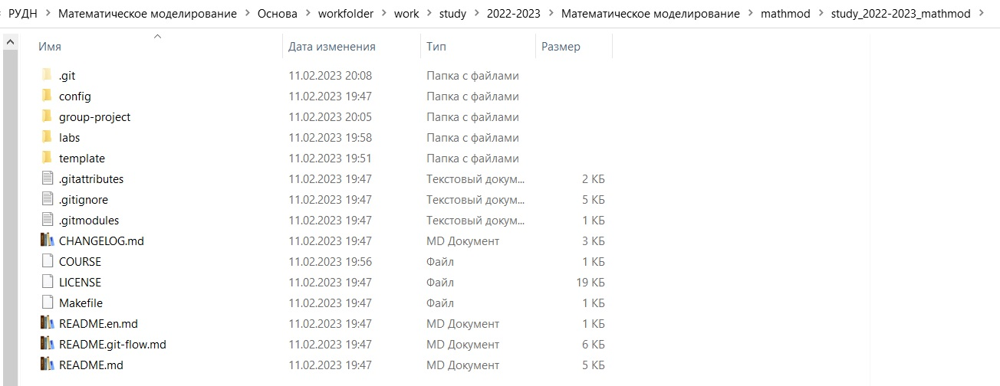
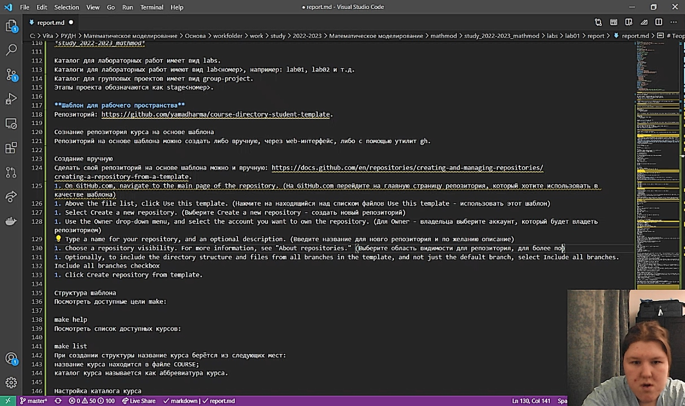

---
## Front matter
lang: ru-RU
title: Презентация к лабораторной работе 1
subtitle: Подготовка рабочего пространства, создание отчёта в markdown
author:
  - Саттарова В.В.
institute:
  - Российский университет дружбы народов, Москва, Россия
date: 11 февраля 2023

## i18n babel
babel-lang: russian
babel-otherlangs: english

## Formatting pdf
toc: false
toc-title: Содержание
slide_level: 2
aspectratio: 169
section-titles: true
theme: metropolis
mainfont: PT Serif
romanfont: PT Serif
sansfont: PT Sans
monofont: PT Mono
header-includes:
 - \metroset{progressbar=frametitle,sectionpage=progressbar,numbering=fraction}
 - '\makeatletter'
 - '\beamer@ignorenonframefalse'
 - '\makeatother'
---

# Информация

## Докладчик

:::::::::::::: {.columns align=center}
::: {.column width="70%"}

  * Саттарова Вита Викторовна
  * студент
  * Российский университет дружбы народов

:::
::::::::::::::

# Вводная часть

## Актуальность

- Рабочее пространство и github будут использоваться для дальнейшей работы по курсу
- Отчёты по курсу делаются с использованием markdown

## Объект и предмет исследования

- github
- markdown

## Цели и задачи

- Подготовить рабочее пространство и репозиторий github
- Написать отчёт в markdown

## Материалы и методы

- Процессор `pandoc` для входного формата Markdown
- Результирующие форматы
	- `pdf`
	- `html`
- Автоматизация процесса создания: `Makefile`

## Содержание исследования (1)

- Клонирование репозитория к себе
- Создание папок

## Содержание исследования (2)
- Отправка на Гит
- Написание отчёта

# Результаты

- Полученный репозиторий будет использоваться для дальнейшей работы
- Полученные навыки написания отчёта пригодятся в дальнейшем для написания таких же отчётов
