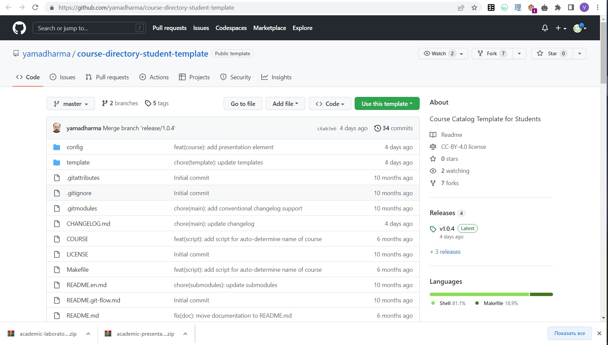
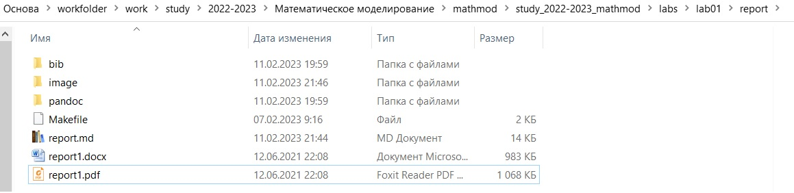

---
## Front matter
title: "Отчёт по лабораторной работе №1"
subtitle: "Подготовка рабочего пространства, создание отчёта в markdown"
author: "Саттарова Вита Викторовна"

## Generic otions
lang: ru-RU
toc-title: "Содержание"

## Bibliography
bibliography: bib/cite.bib
csl: pandoc/csl/gost-r-7-0-5-2008-numeric.csl

## Pdf output format
toc: true # Table of contents
toc-depth: 2
lof: true # List of figures
lot: true # List of tables
fontsize: 12pt
linestretch: 1.5
papersize: a4
documentclass: scrreprt
## I18n polyglossia
polyglossia-lang:
  name: russian
  options:
	- spelling=modern
	- babelshorthands=true
polyglossia-otherlangs:
  name: english
## I18n babel
babel-lang: russian
babel-otherlangs: english
## Fonts
mainfont: PT Serif
romanfont: PT Serif
sansfont: PT Sans
monofont: PT Mono
mainfontoptions: Ligatures=TeX
romanfontoptions: Ligatures=TeX
sansfontoptions: Ligatures=TeX,Scale=MatchLowercase
monofontoptions: Scale=MatchLowercase,Scale=0.9
## Biblatex
biblatex: true
biblio-style: "gost-numeric"
biblatexoptions:
  - parentracker=true
  - backend=biber
  - hyperref=auto
  - language=auto
  - autolang=other*
  - citestyle=gost-numeric
## Pandoc-crossref LaTeX customization
figureTitle: "Рис."
tableTitle: "Таблица"
listingTitle: "Листинг"
lofTitle: "Список иллюстраций"
lotTitle: "Список таблиц"
lolTitle: "Листинги"
## Misc options
indent: true
header-includes:
  - \usepackage{indentfirst}
  - \usepackage{float} # keep figures where there are in the text
  - \floatplacement{figure}{H} # keep figures where there are in the text
---

# Цель работы

Подготовить рабочее пространство для выполнения задач курса "Математическое моделирование". Вспомнить основные этапы работы с github. Вспомнить написание файлов (отчётов) в markdown.

# Задание

- Создайте каталоги для работы на основе документа Рабочее пространство для лабораторной работы.
- Сделайте отчёт по лабораторной работе в формате Markdown.

# Теоретическое введение

## Подготовка рабочего пространства 

Рабочее пространство по предмету располагается в следующей иерархии:

```
~/work/study/
└── <учебный год>/
    └── <название предмета>/
        └── <код предмета>/
```

Например, для 2022-2023 учебного года и предмета «Математическое моделирование» (код предмета mathmod) структура каталогов примет следующий вид:

```
~/work/study/
└── 2022-2023/
    └── Математическое моделирование/
        └── mathmod/
```

Название проекта на хостинге git имеет вид:
*study_<учебный год>_<код предмета>*

Например, для 2022–2023 учебного года и предмета «Математическое моделирование» (код предмета mathmod) название проекта примет следующий вид:

*study_2022-2023_mathmod*

Каталог для лабораторных работ имеет вид labs.
Каталоги для лабораторных работ имеют вид lab<номер>, например: lab01, lab02 и т.д.
Каталог для групповых проектов имеет вид group-project.
Этапы проекта обозначаются как stage<номер>.

**Шаблон для рабочего пространства**
Репозиторий: https://github.com/yamadharma/course-directory-student-template.

*Создание репозитория курса на основе шаблона*
Репозиторий на основе шаблона можно создать либо вручную, через web-интерфейс, либо с помощью утилит gh.

*Создание вручную*
Сделать свой репозиторий на основе шаблона можно и вручную: https://docs.github.com/en/repositories/creating-and-managing-repositories/creating-a-repository-from-a-template.
1. On GitHub.com, navigate to the main page of the repository. (На GitHub.com перейдите на главную страницу репозитория, который хотите использовать в качестве шаблона)
1. Above the file list, click Use this template. (Нажмите на находящийся над списком файлов Use this template - использовать этот шаблон)
1. Select Create a new repository. (Выберите Create a new repository - создать новый репозиторий)
1. Use the Owner drop-down menu, and select the account you want to own the repository. (Для Owner - владельца выберите аккаунт, который будет владеть репозиторием)
1. Type a name for your repository, and an optional description. (Введите название для новго репозитория и по желанию описание)
1. Choose a repository visibility. For more information, see https://docs.github.com/en/repositories/creating-and-managing-repositories/about-repositories#about-repository-visibility. (Выберите область видимости для репозитория, для более подробной информации перейдите по ссылке)
1. Optionally, to include the directory structure and files from all branches in the template, and not just the default branch, select Include all branches. (По желанию выберите Include all branches - добавить все ветки - для добавления всех имеющихся веток из репозитория-шаблона)
1. Click Create repository from template. (Нажмите Create repository from template - создать репозиторий по шаблону)

**Настройка каталога курса**
1. Перейдите в каталог курса:
cd ~/work/study/2022-2023/"Математическое моделирование"/mathmod
Удалите лишние файлы:
package.json

1. Создайте необходимые каталоги:
echo mathmod > COURSE
labs
lab01, ..., lab08
group-project
stage01, ..., stage04

1. Отправьте файлы на сервер:
git add .
git commit -am 'feat(main): make course structure'
git push

## Markdown

1. Чтобы создать заголовок, используйте знак (#), например:
(# This is heading 1)
(## This is heading 2)
(### This is heading 3)
(#### This is heading 4) (Без скобочек () при использовании)
1. Чтобы задать для текста полужирное начертание, заключите его в двойные звездочки:
This text is ** bold **. (Без пробелов при использовании)
1. Чтобы задать для текста курсивное начертание, заключите его в одинарные звездочки:
This text is * italic *. (Без пробелов при использовании)
1. Чтобы задать для текста полужирное и курсивное начертание, заключите его в тройные звездочки:
This is text is both * * * bold and italic * * *. (Без пробелов при использовании)
1. Блоки цитирования создаются с помощью символа >:
(>) The drought had lasted now for ten million years. (Без скобочек () при использовании)
1. Неупорядоченный (маркированный) список можно отформатировать с помощью звездочек или тире:
(- List item 1 - List item 2 - List item 3) (Каждый элемент на своей строке и без скобочек ())
1. Чтобы вложить один список в другой, добавьте отступ для элементов дочернего списка.
1. Упорядоченный список можно отформатировать с помощью цифр:
(1. First instruction 1. Second instruction 1. Third instruction) (Каждый элемент на своей строке и без скобочек ())

1. Синтаксис Markdown для встроенной ссылки состоит из части [link text], представляющей текст гиперссылки, и части(file-name.md) – URL-адреса или имени файла, на который дается ссылка.
1. Markdown поддерживает как встраивание фрагментов кода в предложение, так и их размещение между предложениями в виде отдельных огражденных блоков. Огражденные блоки кода — это простой способ выделить синтаксис для фрагментов кода. Общий формат огражденных блоков кода: ``` в строке над первой строчкой кода и в строке после кода.

**Обработка файлов в формате Markdown**
Для обработки файлов в формате Markdown будем использовать Pandoc
https://pandoc.org/. Конкретно, нам понадобится программа pandoc,
pandoc-citeproc https://github.com/jgm/pandoc/releases, pandoccrossref https://github.com/lierdakil/pandoc-crossref/releases.
Преобразовать файл README.md можно следующим образом:
```
pandoc README.md -o README.pdf
```
или так
```
pandoc README.md -o README.docx
```
Можно использовать следующий *Makefile*
```
FILES = $(patsubst %.md, %.docx, $(wildcard *.md))
FILES += $(patsubst %.md, %.pdf, $(wildcard *.md))
LATEX_FORMAT =
FILTER = --filter pandoc-crossref
%.docx: %.md
-pandoc "$<" $(FILTER) -o "$@"
%.pdf: %.md
-pandoc "$<" $(LATEX_FORMAT) $(FILTER) -o "$@"
all: $(FILES)
@echo $(FILES)
clean:
-rm $(FILES) *~
```

Более подробно о работе см. в [@course:mathmod].

# Выполнение лабораторной работы

1. Зашла на ТУИС на страницу курса и посмотрела материалы к лабораторной работе (рис. @fig:001) (рис. @fig:002)

{ #fig:001 width=100% }

{ #fig:002 width=100% }

1. Перешла по ссылке на репозиторий-шаблон (рис. @fig:003)

{ #fig:003 width=100% }

1. Сделала на его основе новый свой репозиторий для работы на курсе (рис. @fig:004)

{ #fig:004 width=100% }

1. Подготовила папки по схеме из общих правил для рабочего пространства (рис. @fig:005)

{ #fig:005 width=100% }

1. Клонировала репозиторий в конечную папку рабочего пространства (рис. @fig:006)

{ #fig:006 width=100% }

1. Настроила каталог курса: удалила ненужные файлы, создала каталоги для добавления и наполнила их шаблонами для дальнейшей работы (рис. @fig:007)

{ #fig:007 width=100% }

1. Отправила файлы на сервер в свой репозиторий github (рис. @fig:008)

{ #fig:008 width=100% }

1. Открыла шаблон отчёта для лабораторной работы и изменяла его в соответствии с лабораторной работой (рис. @fig:009)

{ #fig:009 width=100% }

1. Преобразовала отчёт в форматы pdf и docx (рис. @fig:010)

{ #fig:010 width=100% }

# Выводы

- Подготовлено рабочее пространство для выполнения заданий курса "Математическое моделирование"
- Подготовлен первый отчёт
- Освежены в памяти основные этапы при работе с github и основы работы с markdown

# Список литературы
@course:mathmod
