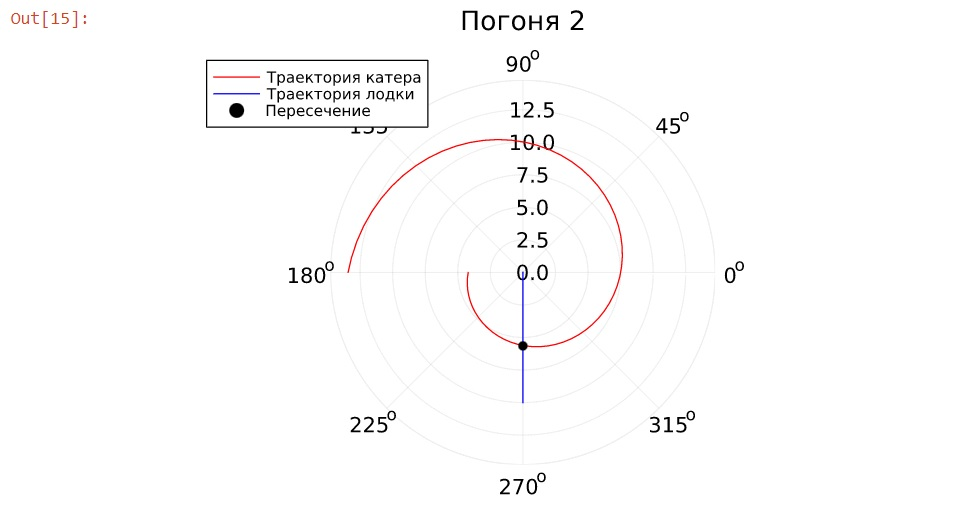

---
## Front matter
lang: ru-RU
title: Презентация к лабораторной работе 2
subtitle: Задача о погоне
author:
  - Саттарова В. В.
institute:
  - Российский университет дружбы народов, Москва, Россия
date: 18 февраля 2023

## i18n babel
babel-lang: russian
babel-otherlangs: english

## Formatting pdf
toc: false
toc-title: Содержание
slide_level: 2
aspectratio: 169
section-titles: true
theme: metropolis
mainfont: PT Serif
romanfont: PT Serif
sansfont: PT Sans
monofont: PT Mono
header-includes:
 - \metroset{progressbar=frametitle,sectionpage=progressbar,numbering=fraction}
 - '\makeatletter'
 - '\beamer@ignorenonframefalse'
 - '\makeatother'
---

# Вводная часть

## Актуальность

Задача о погоне является хорошим и наглядным примером построения математических моделей для выбора правильной стратегии при решении задач поиска с использованием полярных координат и языков научного программирования.

## Объект и предмет исследования

- Задача о погоне

## Цели и задачи

- Вывести дифференциальное уравнение для решения задачи о погоне
- Написать код на Julia для вычисления уравнения и визуализации результатов

## Материалы и методы

- Лист бумаги с ручкой
- Julia (REPL)
- Jupiter Notebook (IJulia)
- Курс на ТУИС "Математическое моделирование"

# Содержание исследования

## Вывод дифференциального уравнения

## Решение уравнения

## Данные лодки и точка пересечения

## Визуализация результатов

## График 1

## График 2

# Результаты

# Результаты работы

- Решена задача о погоне
- Построены графики 
