---
## Front matter
title: "Лабораторная работа 1"
subtitle: "Задача о погоне"
author: "Саттарова Вита Викторовна"

## Generic otions
lang: ru-RU
toc-title: "Содержание"

## Bibliography
bibliography: bib/cite.bib
csl: pandoc/csl/gost-r-7-0-5-2008-numeric.csl

## Pdf output format
toc: true # Table of contents
toc-depth: 2
lof: true # List of figures
lot: true # List of tables
fontsize: 12pt
linestretch: 1.5
papersize: a4
documentclass: scrreprt
## I18n polyglossia
polyglossia-lang:
  name: russian
  options:
	- spelling=modern
	- babelshorthands=true
polyglossia-otherlangs:
  name: english
## I18n babel
babel-lang: russian
babel-otherlangs: english
## Fonts
mainfont: PT Serif
romanfont: PT Serif
sansfont: PT Sans
monofont: PT Mono
mainfontoptions: Ligatures=TeX
romanfontoptions: Ligatures=TeX
sansfontoptions: Ligatures=TeX,Scale=MatchLowercase
monofontoptions: Scale=MatchLowercase,Scale=0.9
## Biblatex
biblatex: true
biblio-style: "gost-numeric"
biblatexoptions:
  - parentracker=true
  - backend=biber
  - hyperref=auto
  - language=auto
  - autolang=other*
  - citestyle=gost-numeric
## Pandoc-crossref LaTeX customization
figureTitle: "Рис."
tableTitle: "Таблица"
listingTitle: "Листинг"
lofTitle: "Список иллюстраций"
lotTitle: "Список таблиц"
lolTitle: "Листинги"
## Misc options
indent: true
header-includes:
  - \usepackage{indentfirst}
  - \usepackage{float} # keep figures where there are in the text
  - \floatplacement{figure}{H} # keep figures where there are in the text
---

# Цель работы

Решить задачу о погоне, вывести уравнения и нарисовать траектории с использованием научных языков программирования

# Задание

**Вариант 66**
На море в тумане катер береговой охраны преследует лодку браконьеров. Через определенный промежуток времени туман рассеивается, и лодка обнаруживается на расстоянии 18,9 км от катера. Затем лодка снова скрывается в тумане и уходит прямолинейно в неизвестном направлении. Известно, что скорость катера в 5,5 раза больше скорости браконьерской лодки.

1. Запишите уравнение, описывающее движение катера, с начальными условиями для двух случаев (в зависимости от расположения катера относительно лодки в начальный момент времени).
1. Постройте траекторию движения катера и лодки для двух случаев.
1. Найдите точку пересечения траектории катера и лодки.

# Теоретическое введение

Пример рассуждений и выведения уравнения для похожей задачи: (рис. @fig:001) (рис. @fig:002) (рис. @fig:003) (рис. @fig:004) (рис. @fig:005) (рис. @fig:006). 

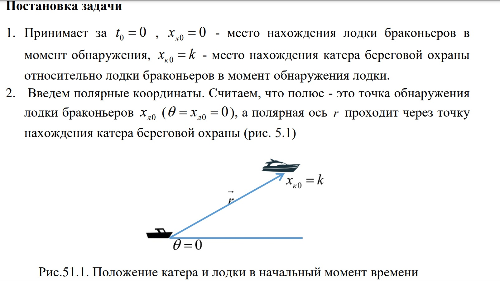{#fig:001 width=70%}
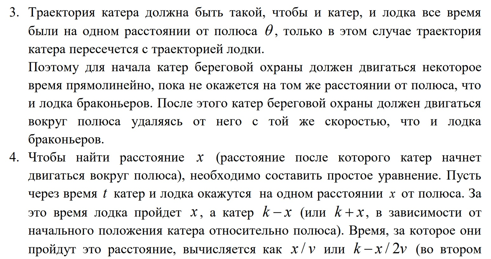{#fig:002 width=70%}
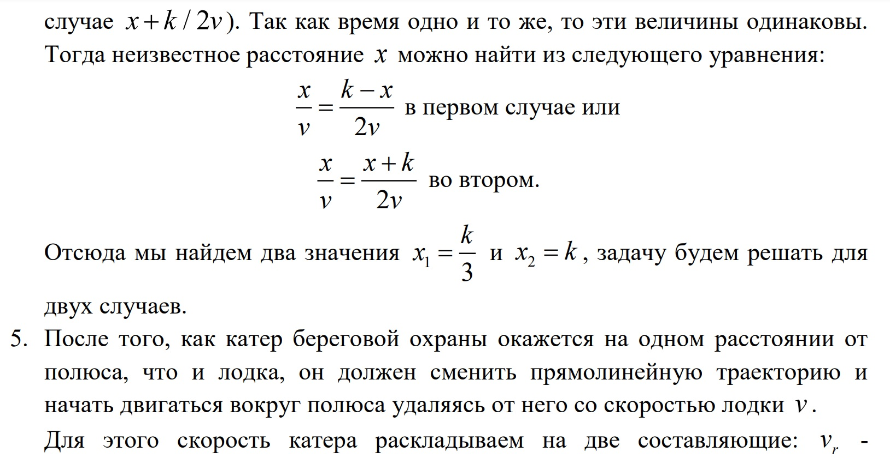{#fig:003 width=70%}
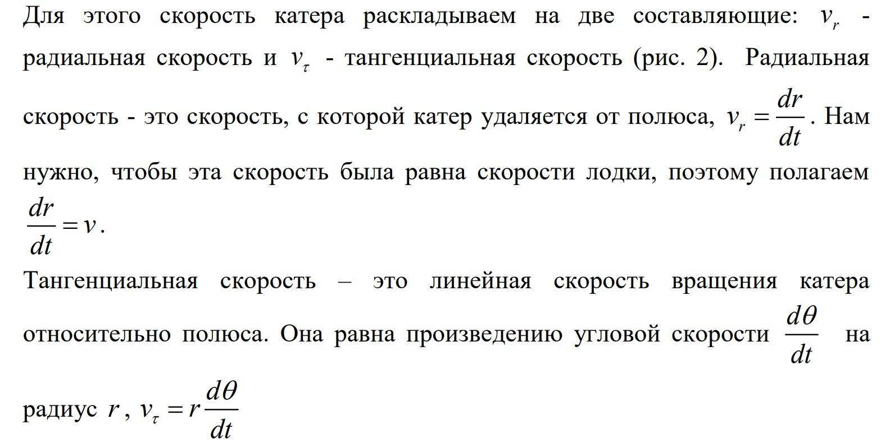{#fig:004 width=70%}
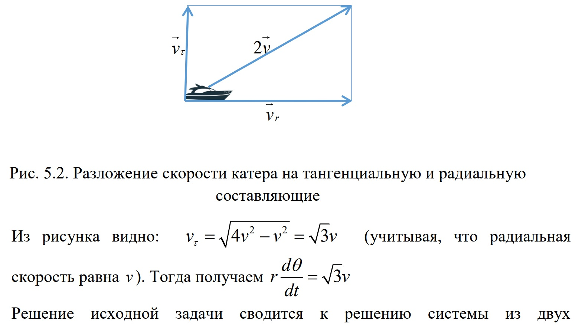{#fig:005 width=70%}
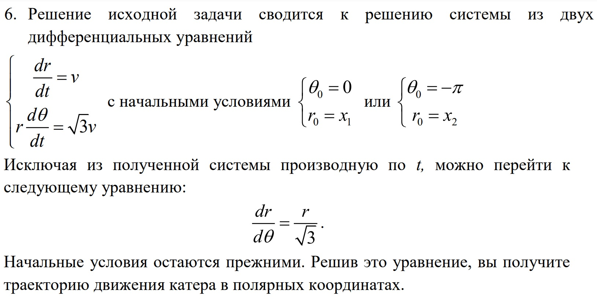{#fig:006 width=70%}   
                                                                      |
Более подробно об Unix см. в справочнике на сайте ТУИС на странице курса "Математическое моделирование" [1].

# Выполнение лабораторной работы

1. Объяснила задачу и вывела дифференциальное уравнение для её решения. (рис. @fig:007)

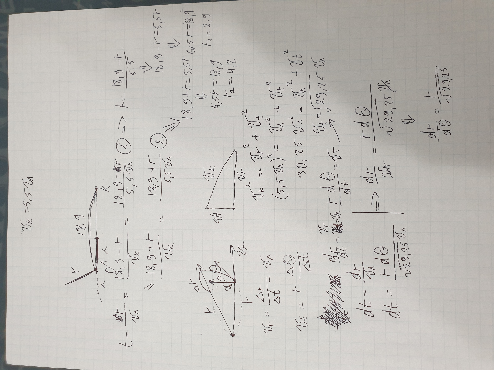{#fig:007 width=70%}

1. Подключила библиотеки, написала основную функцию, создала задачи для решения уравнения и решила его. (рис. @fig:008)

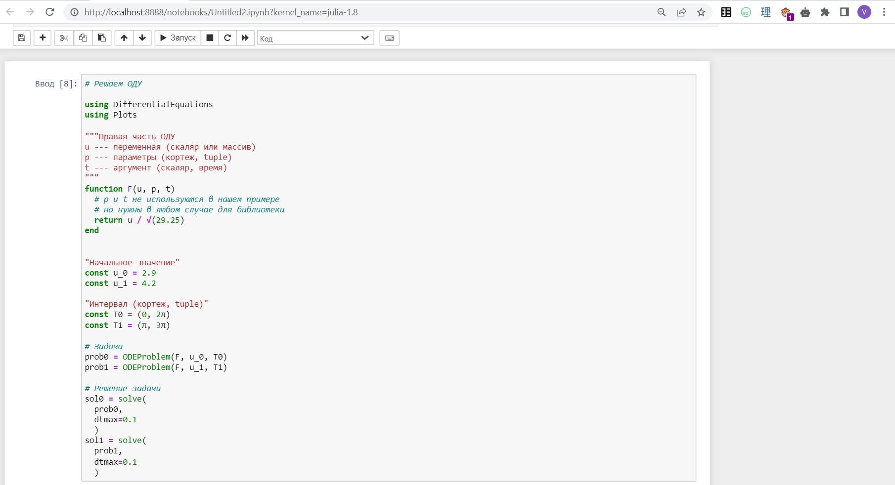{#fig:008 width=70%}

1. Задала данные лодки, написала функцию для нахождения точки пересечения и высчитала её. (рис. @fig:009)

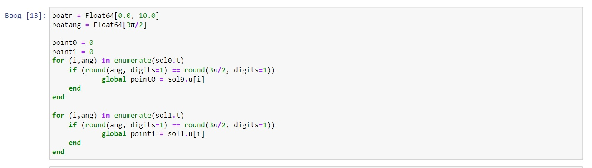{#fig:009 width=70%}

1. Создала график для случая 1. (рис. @fig:010)

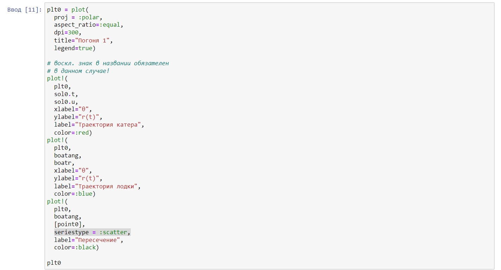{#fig:010 width=70%}

1. Вид графика 1. (рис. @fig:011)

{#fig:011 width=70%}

1. Создала график для случая 2. (рис. @fig:012)

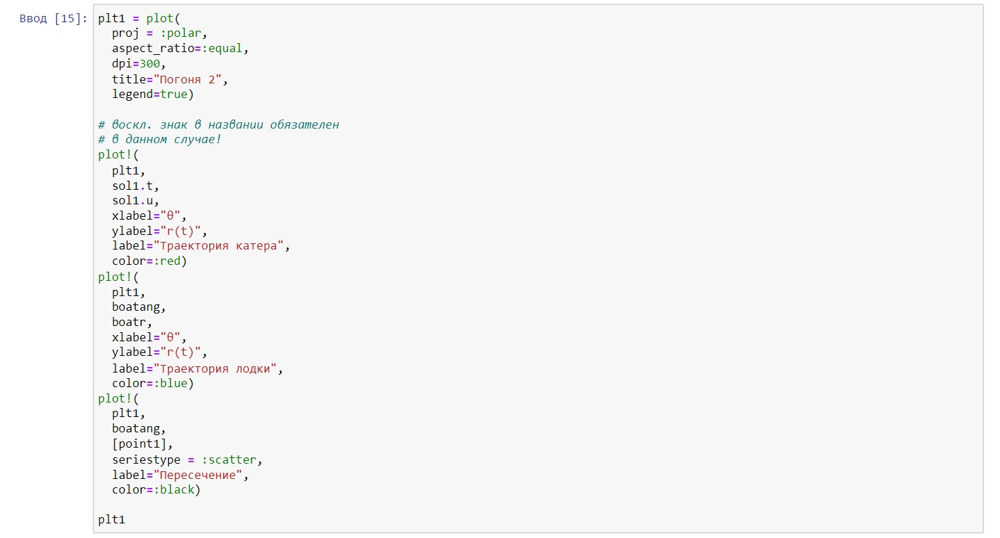{#fig:012 width=70%}

1. Вид графика 2. (рис. @fig:013)

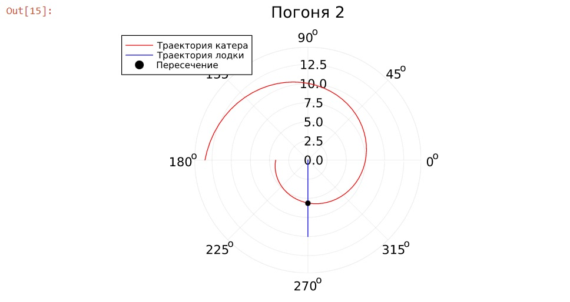{#fig:013 width=70%}

На OpenModelica решить задачу не получилось так как там сложно строить график в полярных координатах, который замечательно иллюстрирует эту задачу.

# Выводы

В результате работы удалось решить решить задачу о погоне, изобразить траектории движения объектов и их пересечение с использованием языка научного программирования Julia.

# Список литературы{.unnumbered}

[1] Справочная информация для лабораторной работы 2 в ТУИС на курсе "Математическое моделирование".
