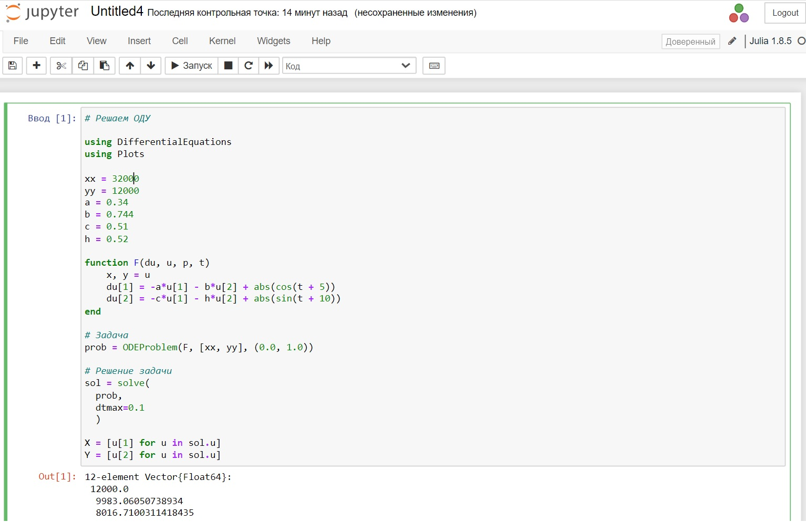
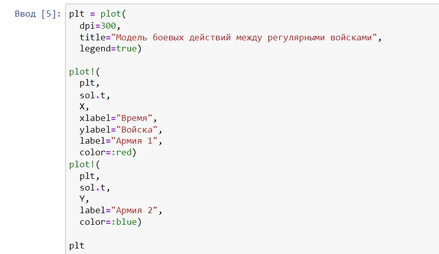
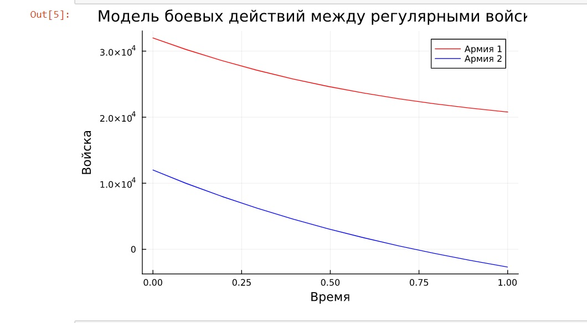
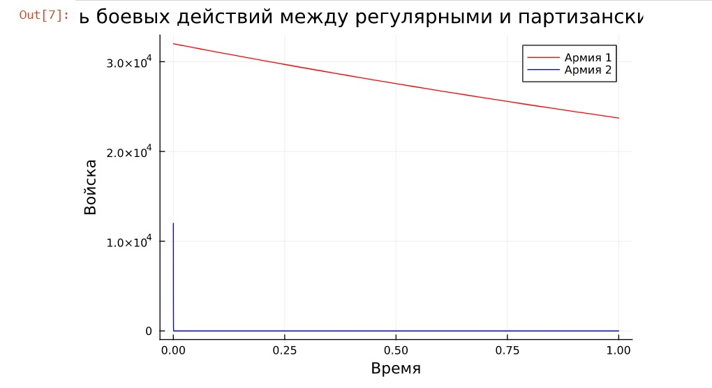
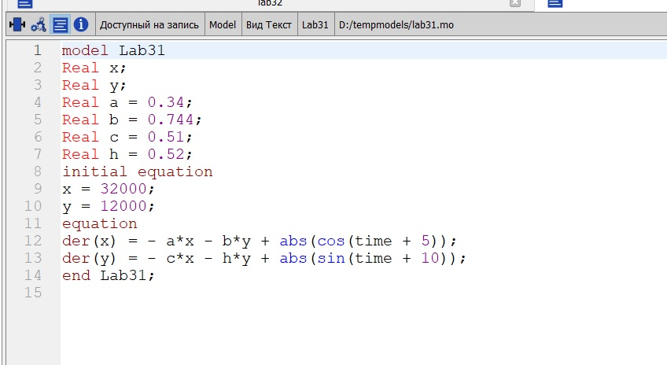
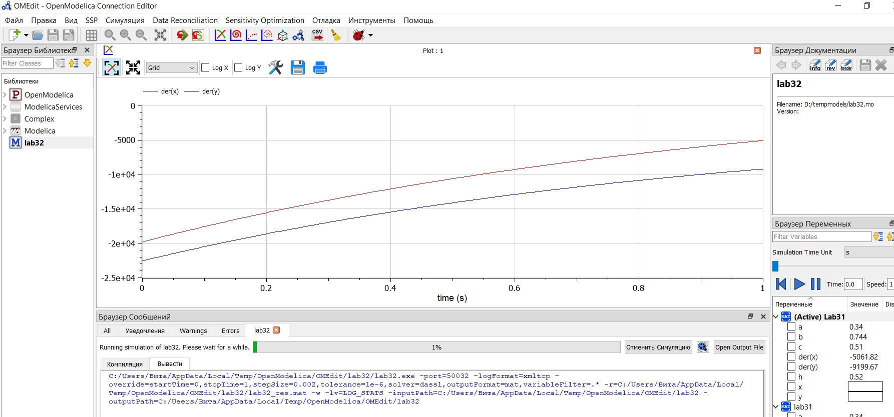
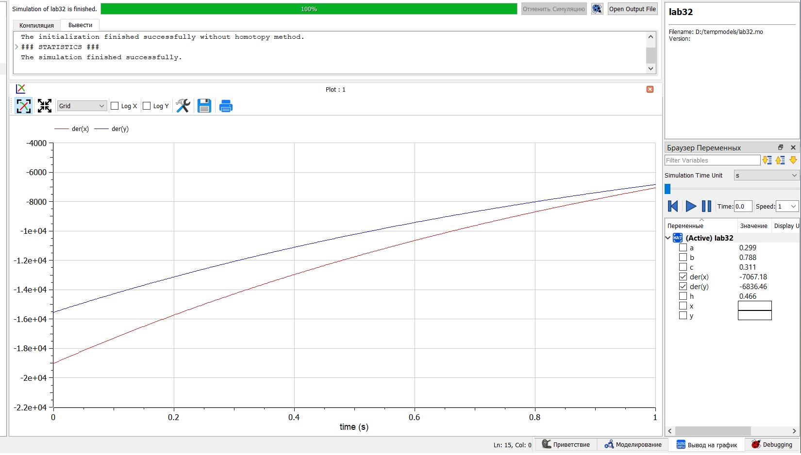

---
## Front matter
lang: ru-RU
title: Презентация к лабораторной работе 3
subtitle: Задача об армиях
author:
  - Саттарова В. В.
institute:
  - Российский университет дружбы народов, Москва, Россия
date: 18 февраля 2023

## i18n babel
babel-lang: russian
babel-otherlangs: english

## Formatting pdf
toc: false
toc-title: Содержание
slide_level: 2
aspectratio: 169
section-titles: true
theme: metropolis
mainfont: PT Serif
romanfont: PT Serif
sansfont: PT Sans
monofont: PT Mono
header-includes:
 - \metroset{progressbar=frametitle,sectionpage=progressbar,numbering=fraction}
 - '\makeatletter'
 - '\beamer@ignorenonframefalse'
 - '\makeatother'
---

# Вводная часть

## Актуальность

Модели боевых действий - простейшие модели соперничества, которые соответствуют системам обыкновенных дифференциальных уравнений второго порядка, широко распространенным при описании многих естественно научных объектов. Построение таких моделей позволит получить навыки построения моделей с использованием систем обыкновенных дифференциальных уравнений второго порядка.

## Объект и предмет исследования

- Построение моделей боевых действий

## Цели и задачи

- Построить модели на Julia.
- Построить модели на OpenModelica.
- Проанализировать результаты.

## Материалы и методы

- Julia (REPL)
- Jupiter Notebook (IJulia)
- OpenModelica Connection Editor
- Курс на ТУИС "Математическое моделирование"

# Содержание исследования

## Написание кода задачи Julia

## Написание кода для графика Julia

## График 1 Julia

## График 2 Julia

## Написание кода OpenModelica

## График 1 OpenModelica

## График 2 OpenModelica

# Результаты

# Результаты работы

- Построены 2 модели на Julia
- Построены 2 модели на OpenModelica
