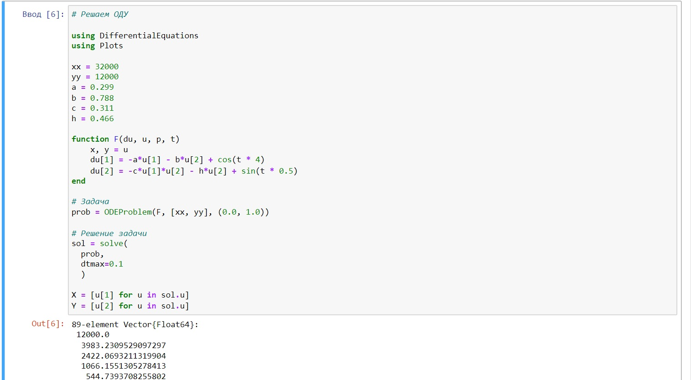

---
## Front matter
title: "Лабораторная работа 3"
subtitle: "Задача об армиях"
author: "Саттарова Вита Викторовна"

## Generic otions
lang: ru-RU
toc-title: "Содержание"

## Bibliography
bibliography: bib/cite.bib
csl: pandoc/csl/gost-r-7-0-5-2008-numeric.csl

## Pdf output format
toc: true # Table of contents
toc-depth: 2
lof: true # List of figures
lot: true # List of tables
fontsize: 12pt
linestretch: 1.5
papersize: a4
documentclass: scrreprt
## I18n polyglossia
polyglossia-lang:
  name: russian
  options:
	- spelling=modern
	- babelshorthands=true
polyglossia-otherlangs:
  name: english
## I18n babel
babel-lang: russian
babel-otherlangs: english
## Fonts
mainfont: PT Serif
romanfont: PT Serif
sansfont: PT Sans
monofont: PT Mono
mainfontoptions: Ligatures=TeX
romanfontoptions: Ligatures=TeX
sansfontoptions: Ligatures=TeX,Scale=MatchLowercase
monofontoptions: Scale=MatchLowercase,Scale=0.9
## Biblatex
biblatex: true
biblio-style: "gost-numeric"
biblatexoptions:
  - parentracker=true
  - backend=biber
  - hyperref=auto
  - language=auto
  - autolang=other*
  - citestyle=gost-numeric
## Pandoc-crossref LaTeX customization
figureTitle: "Рис."
tableTitle: "Таблица"
listingTitle: "Листинг"
lofTitle: "Список иллюстраций"
lotTitle: "Список таблиц"
lolTitle: "Листинги"
## Misc options
indent: true
header-includes:
  - \usepackage{indentfirst}
  - \usepackage{float} # keep figures where there are in the text
  - \floatplacement{figure}{H} # keep figures where there are in the text
---

# Цель работы

Построить 2 модели боевых действий: между регулярными войсками и между регулярными войсками с участием партизанских отрядов, используя Julia и OpenModelica.

# Задание

**Вариант 66**
Задание. (рис. @fig:000)
{#fig:000 width=70%}

# Теоретическое введение

Рассмотрим некоторые простейшие модели боевых действий – модели Ланчестера. В противоборстве могут принимать участие как регулярные войска, так и партизанские отряды. В общем случае главной характеристикой соперников являются численности сторон. Если в какой-то момент времени одна из численностей обращается в нуль, то данная сторона считается проигравшей (при условии, что численность другой стороны в данный момент положительна).
Рассмотри два случая ведения боевых действий:
1. Боевые действия между регулярными войсками
1. Боевые действия с участием регулярных войск и партизанских отрядов
В первом случае численность регулярных войск определяется тремя
факторами:
- скорость уменьшения численности войск из-за причин, не связанных с боевыми действиями (болезни, травмы, дезертирство);
- скорость потерь, обусловленных боевыми действиями противоборствующих сторон (что связанно с качеством стратегии, уровнем вооружения, профессионализмом солдат и т.п.);
- скорость поступления подкрепления (задаётся некоторой функцией от времени).
В этом случае модель боевых действий между регулярными войсками описывается следующим образом (рис. @fig:0001)

{#fig:0001 width=70%}

Потери, не связанные с боевыми действиями, описывают члены -a(t)x(t) и -h(t)x(t), члены -b(t)x(t) и -c(t)x(t) отражают потери на поле боя.
Коэффициенты b(t) и c(t) указывают на эффективность боевых действий со стороны у и х соответственно, a(t), h(t) - величины, характеризующие степень влияния различных факторов на потери. (рис. @fig:0001)                                                                 |

{#fig:0002 width=70%} 

Более подробно см. в справочнике на сайте ТУИС на странице курса "Математическое моделирование" [1].

# Выполнение лабораторной работы

1. Написала код задачи для модели 1 на Julia. (рис. @fig:001)

{#fig:001 width=70%}

1. Создала график для модели 1. (рис. @fig:002)

{#fig:002 width=70%}

1. Сам график. (рис. @fig:003)

{#fig:003 width=70%}

1. Написала код задачи для модели 2 на Julia. (рис. @fig:004)

{#fig:004 width=70%}

1. Создала график для модели 2. (рис. @fig:005)

{#fig:005 width=70%}

1. Сам график. (рис. @fig:006)

{#fig:006 width=70%}

1. Написала код задачи для модели 1 на OpenModelica. (рис. @fig:007)

{#fig:007 width=70%}

1. Создала график для модели 1. (рис. @fig:008)

{#fig:008 width=70%}

1. Написала код задачи для модели 2 на OpenModelica. (рис. @fig:009)

{#fig:009 width=70%}

1. Создала график для модели 2. (рис. @fig:010)

{#fig:010 width=70%}
# Выводы

В результате работы удалось создать 2 модели боевых действий на Julia и OpenModelica, изобразить изменение количества войск на графиках.

# Список литературы{.unnumbered}

[1] Справочная информация для лабораторной работы 3 в ТУИС на курсе "Математическое моделирование" URL: https://esystem.rudn.ru/pluginfile.php/1971652/mod_resource/content/2/%D0%9B%D0%B0%D0%B1%D0%BE%D1%80%D0%B0%D1%82%D0%BE%D1%80%D0%BD%D0%B0%D1%8F%20%D1%80%D0%B0%D0%B1%D0%BE%D1%82%D0%B0%20%E2%84%96%202.pdf.
