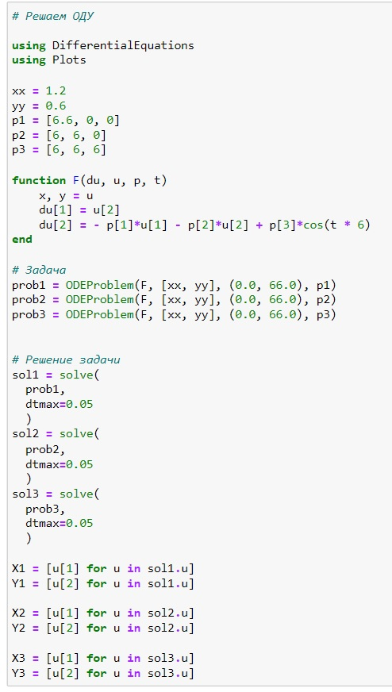
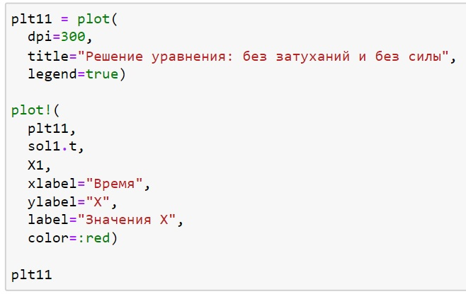
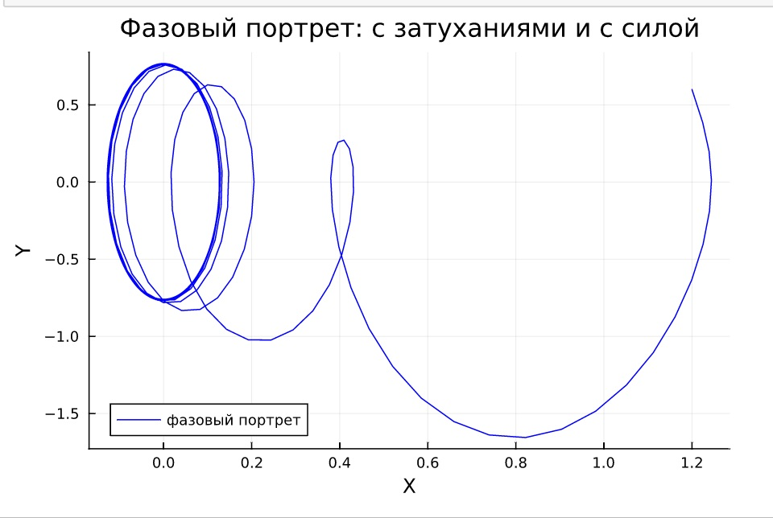
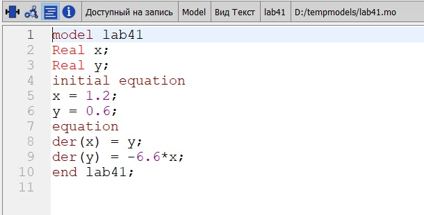
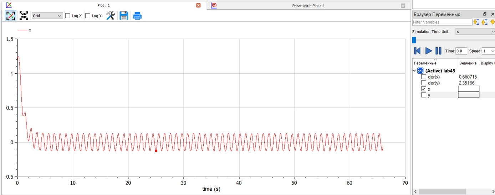
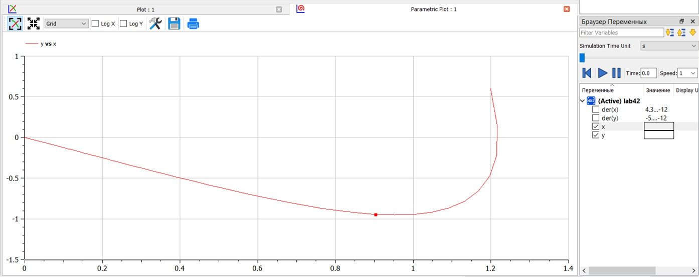

---
## Front matter
lang: ru-RU
title: Презентация к лабораторной работе 4
subtitle: Модель гармонического осциллятора
author:
  - Саттарова В. В.
institute:
  - Российский университет дружбы народов, Москва, Россия
date: 4 марта 2023

## i18n babel
babel-lang: russian
babel-otherlangs: english

## Formatting pdf
toc: false
toc-title: Содержание
slide_level: 2
aspectratio: 169
section-titles: true
theme: metropolis
mainfont: PT Serif
romanfont: PT Serif
sansfont: PT Sans
monofont: PT Mono
header-includes:
 - \metroset{progressbar=frametitle,sectionpage=progressbar,numbering=fraction}
 - '\makeatletter'
 - '\beamer@ignorenonframefalse'
 - '\makeatother'
---

# Вводная часть

## Актуальность

Для построения модели гармонического осциллятора необходимо решить дифференциальное уравнение второго порядка, которые широко распространены при описании многих естественно научных объектов. Для визуализации результатов необходимо такде построить параметрический график. Построение таких моделей и графиков позволит получить навыки построения моделей с использованием дифференциальных уравнений второго порядка, а также навыки построения графиков в параметрических координатах.

## Объект и предмет исследования

Построение моделей гармонического осциллятора:

- колебания гармонического осциллятора без затуханий и без действий внешней силы;
- колебания гармонического осциллятора c затуханием и без действий внешней силы;
- колебания гармонического осциллятора c затуханием и под действием внешней силы.

## Цели и задачи

- Построить модели на Julia.
- Построить модели на OpenModelica.
- Проанализировать результаты.

## Материалы и методы

- Julia (REPL)
- Jupiter Notebook (IJulia)
- OpenModelica Connection Editor
- Курс на ТУИС "Математическое моделирование"

# Содержание исследования

## Написание кода задачи Julia

## Написание кода для графика Julia

## График Julia

## Написание кода OpenModelica

## График решения OpenModelica

## График фазового портрета OpenModelica

# Результаты

# Результаты работы

- Построены 3 модели на Julia и графики решения дифференциального уравнения колебаний гармонического осциллятора и фазового портрета
- Построены 3 модели на OpenModelica и графики решения дифференциального уравнения колебаний гармонического осциллятора и фазового портрета
- Было проведено сравнение результатов: результаты идентичны, однако реалиация раздичается в силу особенностей языков
