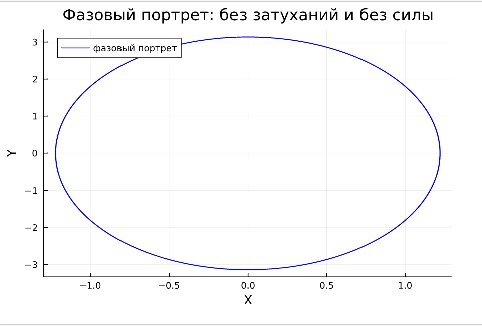

---
## Front matter
title: "Лабораторная работа 4"
subtitle: "Модель гармонического осциллятора"
author: "Саттарова Вита Викторовна"

## Generic otions
lang: ru-RU
toc-title: "Содержание"

## Bibliography
bibliography: bib/cite.bib
csl: pandoc/csl/gost-r-7-0-5-2008-numeric.csl

## Pdf output format
toc: true # Table of contents
toc-depth: 2
lof: true # List of figures
lot: true # List of tables
fontsize: 12pt
linestretch: 1.5
papersize: a4
documentclass: scrreprt
## I18n polyglossia
polyglossia-lang:
  name: russian
  options:
	- spelling=modern
	- babelshorthands=true
polyglossia-otherlangs:
  name: english
## I18n babel
babel-lang: russian
babel-otherlangs: english
## Fonts
mainfont: PT Serif
romanfont: PT Serif
sansfont: PT Sans
monofont: PT Mono
mainfontoptions: Ligatures=TeX
romanfontoptions: Ligatures=TeX
sansfontoptions: Ligatures=TeX,Scale=MatchLowercase
monofontoptions: Scale=MatchLowercase,Scale=0.9
## Biblatex
biblatex: true
biblio-style: "gost-numeric"
biblatexoptions:
  - parentracker=true
  - backend=biber
  - hyperref=auto
  - language=auto
  - autolang=other*
  - citestyle=gost-numeric
## Pandoc-crossref LaTeX customization
figureTitle: "Рис."
tableTitle: "Таблица"
listingTitle: "Листинг"
lofTitle: "Список иллюстраций"
lotTitle: "Список таблиц"
lolTitle: "Листинги"
## Misc options
indent: true
header-includes:
  - \usepackage{indentfirst}
  - \usepackage{float} # keep figures where there are in the text
  - \floatplacement{figure}{H} # keep figures where there are in the text
---

# Цель работы

Построить, используя Julia и OpenModelica, 3 модели колебаний гармонического осциллятора с заданными параметрами, начальными условиями, на заданном интервале с заданным временным шагом: колебания гармонического осциллятора без затуханий и без действий внешней силы, колебания гармонического осциллятора c затуханием и без действий внешней силы, колебания гармонического осциллятора c затуханием и под действием внешней силы, - построить для каждой модели фазовый портрет гармонического осциллятора и решение уравнения гармонического осциллятора.  

# Задание

**Вариант 66**
Задание. (рис. @fig:000)

{#fig:000 width=70%}

# Теоретическое введение

Движение грузика на пружинке, маятника, заряда в электрическом контуре, а также эволюция во времени многих систем в физике, химии, биологии и других
науках при определенных предположениях можно описать одним и тем же дифференциальным уравнением, которое в теории колебаний выступает в качестве основной модели. Эта модель называется линейным гармоническим осциллятором. 

Уравнение свободных колебаний гармонического осциллятора имеет следующий вид: (1) $\ddot{x}+2\gamma\dot{x}+\omega_0^2x=0$.    

где $x$ – переменная, описывающая состояние системы (смещение грузика, заряд конденсатора и т.д.), $\gamma$ – параметр, характеризующий потери энергии (трение в
механической системе, сопротивление в контуре), $\omega_{0}$ – собственная частота колебаний, $t$ – время. (Обозначения $\ddot{x} = \frac{\partial^2 x}{\partial t^2}, \dot{x} = \frac{\partial x}{\partial t}$)

Уравнение (1) есть линейное однородное дифференциальное уравнение второго порядка и оно является примером линейной динамической системы. При отсутствии потерь в системе $\left(\gamma=0\right)$ вместо уравнения (1) получаем уравнение консервативного осциллятора энергия колебания которого сохраняется во времени: (2) $\ddot{x}+2\gamma\dot{x}+\omega_0^2x=0$.

Для однозначной разрешимости уравнения второго порядка необходимо задать два начальных условия вида: (3) $\begin{cases}x\left(t_{0}\right)=x_{0} \\\dot{x}\left(t_{0}\right)=y_{0} \end{cases}$.

Уравнение второго порядка (2) можно представить в виде системы двух уравнений первого порядка: (4) $\begin{cases}\dot{x}=y \\\dot{y}=-\omega_0^2x \end{cases}$.

Начальные условия (3) для системы (4) примут вид: (5) $\begin{cases}x\left(t_{0}\right)=x_{0} \\y\left(t_{0}\right)=y_{0} \end{cases}$.

Независимые переменные $x$, $y$ определяют пространство, в котором «движется» решение. Это фазовое пространство системы, поскольку оно двумерно будем называть его фазовой плоскостью. Значение фазовых координат $x$, $y$ в любой момент времени полностью определяет состояние системы. Решению уравнения движения как функции времени отвечает гладкая кривая в фазовой плоскости. Она называется фазовой траекторией. Если множество различных решений (соответствующих различным начальным условиям) изобразить на одной фазовой плоскости, возникает общая картина поведения системы. Такую картину, образованную набором фазовых траекторий, называют фазовым портретом.

Более подробно см. в справочнике на сайте ТУИС на странице курса "Математическое моделирование" [1] [@mm:lab4].

# Выполнение лабораторной работы

1. Написала код задач для всех моделей: 1 - колебания гармонического осциллятора без затуханий и без действий внешней силы, 2 - колебания гармонического осциллятора c затуханием и без действий внешней силы, 3 - колебания гармонического осциллятора c затуханием и под действием внешней силы, - и подготовила результаты для представления на Julia. (рис. @fig:001)

{#fig:001 width=70%}

1. Создала график решения (значения х) для модели 1. (рис. @fig:002)

{#fig:002 width=70%}

1. Сам график решения уравнения для модели 1. (рис. @fig:003)

{#fig:003 width=70%}

1. Создала график фазового портрета для модели 1. (рис. @fig:004)

{#fig:004 width=70%}

1. Сам фазовый портрет для модели 1. (рис. @fig:005)

{#fig:005 width=70%}

1. Создала график решения (значения х) для модели 2. (рис. @fig:006)

{#fig:006 width=70%}

1. Сам график решения уравнения для модели 2. (рис. @fig:007)

{#fig:007 width=70%}

1. Создала график фазового портрета для модели 2. (рис. @fig:008)

{#fig:008 width=70%}

1. Сам фазовый портрет для модели 2. (рис. @fig:009)

{#fig:009 width=70%}

1. Создала график решения (значения х) для модели 3. (рис. @fig:010)

{#fig:010 width=70%}

1. Сам график решения уравнения для модели 2. (рис. @fig:011)

{#fig:011 width=70%}

1. Создала график фазового портрета для модели 3. (рис. @fig:012)

{#fig:012 width=70%}

1. Сам фазовый портрет для модели 3. (рис. @fig:013)

{#fig:013 width=70%}

1. Написала код модели 1 на OpenModelica. (рис. @fig:014)

{#fig:014 width=70%}

1. Создала график решения (значения х) для модели 1. (рис. @fig:015)

{#fig:015 width=70%}

1. Создала график фазового портрета для модели 1. (рис. @fig:016)

{#fig:016 width=70%}

1. Написала код модели 2 на OpenModelica. (рис. @fig:017)

{#fig:017 width=70%}

1. Создала график решения (значения х) для модели 2. (рис. @fig:018)

{#fig:018 width=70%}

1. Создала график фазового портрета для модели 2. (рис. @fig:019)

{#fig:019 width=70%}

1. Написала код модели 3 на OpenModelica. (рис. @fig:020)

{#fig:020 width=70%}

1. Создала график решения (значения х) для модели 3. (рис. @fig:021)

{#fig:021 width=70%}

1. Создала график фазового портрета для модели 3. (рис. @fig:022)

{#fig:022 width=70%}

# Сравнение Julia и OpenModelica

Результаты получились одинаковые, однако на Julia можно было строить одновременно 3 модели, в то время как на OpenModelica их необходимо было создавать в отдельных файлах. Также в Julia необходимо было в формате кода задать начальные параметры и создать графики, тогда как на OpenModelica для этого используется графический интерфейс. В связи с этим, код на OpenModelica намного короче, чем на Julia.

# Выводы

В результате работы удалось создать 3 модели колебаний гармонического осциллятора: колебания гармонического осциллятора без затуханий и без действий внешней силы, колебания гармонического осциллятора c затуханием и без действий внешней силы, колебания гармонического осциллятора c затуханием и под действием внешней силы. Также удалось отобразить на графиках решение дифференциального уравнения, описывающего колебания осциллятора, и фазовый портрет на Julia и OpenModelica.

# Список литературы{.unnumbered}

[1] Справочная информация для лабораторной работы 3 в ТУИС на курсе "Математическое моделирование" URL: https://esystem.rudn.ru/pluginfile.php/1971656/mod_resource/content/2/%D0%9B%D0%B0%D0%B1%D0%BE%D1%80%D0%B0%D1%82%D0%BE%D1%80%D0%BD%D0%B0%D1%8F%20%D1%80%D0%B0%D0%B1%D0%BE%D1%82%D0%B0%20%E2%84%96%203.pdf.
