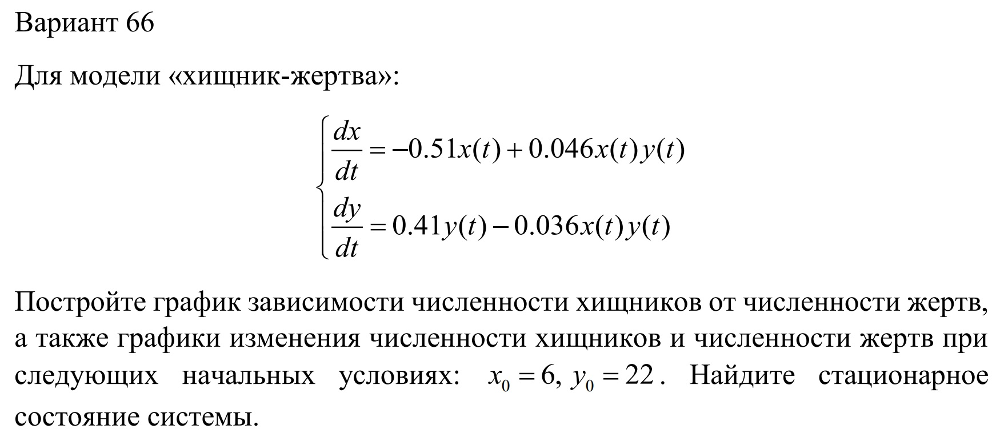
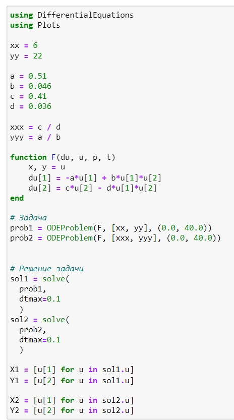
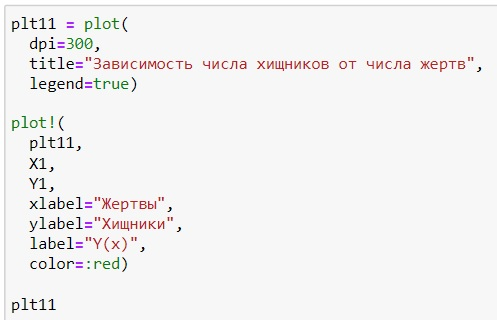
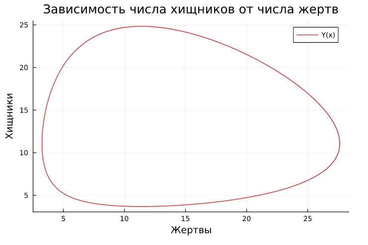
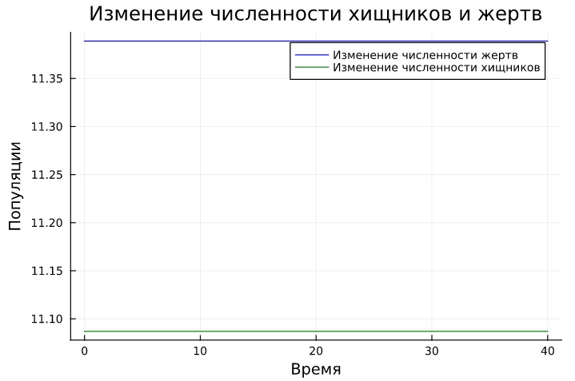
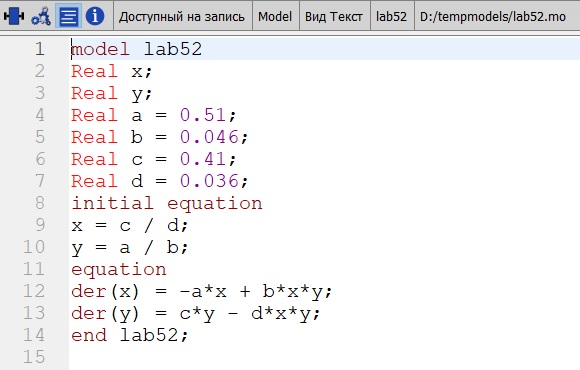
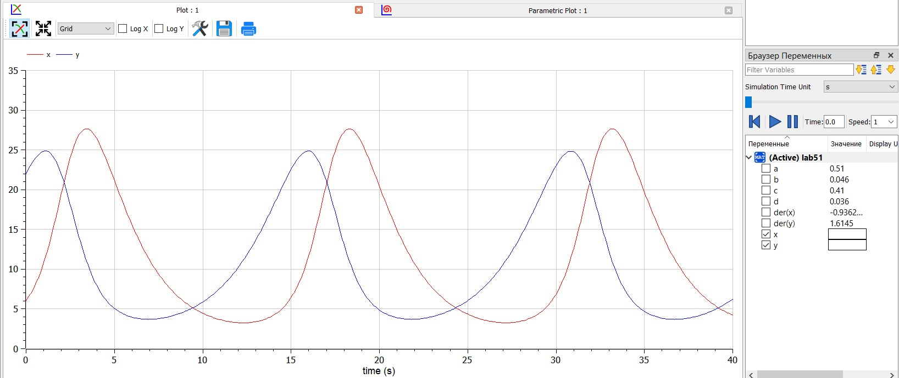

---
## Front matter
lang: ru-RU
title: Презентация к лабораторной работе 5
subtitle: Модель хищник - жертва
author:
  - Саттарова В. В.
institute:
  - Российский университет дружбы народов, Москва, Россия
date: 11 марта 2023

## i18n babel
babel-lang: russian
babel-otherlangs: english

## Formatting pdf
toc: false
toc-title: Содержание
slide_level: 2
aspectratio: 169
section-titles: true
theme: metropolis
mainfont: PT Serif
romanfont: PT Serif
sansfont: PT Sans
monofont: PT Mono
header-includes:
 - \metroset{progressbar=frametitle,sectionpage=progressbar,numbering=fraction}
 - '\makeatletter'
 - '\beamer@ignorenonframefalse'
 - '\makeatother'
---

# Вводная часть

## Актуальность

Модель хищник-жертва - сложная экосистема, для которой реализованы долговременные отношения между видами хищника и жертвы, типичный пример коэволюции. Отношения между хищниками и их жертвами развиваются циклически, являясь иллюстрацией нейтрального равновесия. Для построения модели хищник-жертва необходимо решить систему дифференциальных уравнений, которые широко распространены при описании многих естественно научных объектов. Для визуализации результатов необходимо также построить классические графики и параметрический график. Построение таких моделей и графиков на Julia и OpenModelica - популярных для решения научных задач языках програмирования, позволит получить навыки построения моделей на этих языках с использованием дифференциальных уравнений, а также навыки построения различных графиков. 

## Объект и предмет исследования

Построение модели хищник-жертва с разными условиями:

- с заданными начальными условиями;
- условиями, при которых система достигает стационарного состояния.

Построение графиков:

- зависимости численности хищников от численности жертв;
- изменения численности популяций жертв и хищников.

## Цели и задачи

- Построить модель на Julia.
- Построить модель на OpenModelica.
- Проанализировать результаты.

## Материалы и методы

- Julia (REPL)
- Jupiter Notebook (IJulia)
- OpenModelica Connection Editor
- Курс на ТУИС "Математическое моделирование"

# Содержание исследования

## Условие

## Написание кода задачи Julia

## Написание кода для графика Julia

## График y(x) Julia

## График x(t) y(t) Julia

## Написание кода OpenModelica

## График решения OpenModelica

# Результаты работы

- Построена модель хищник-жертва на Julia и графики зависимости популяции хищников от популяции жертв, изменения численности популяций жертв и хищников для заданных начальных условий и для условий, которые система принимает в стационарном состоянии.
- Построены модель хищник-жертва на OpenModelica и графики зависимости популяции хищников от популяции жертв, изменения численности популяций жертв и хищников для заданных начальных условий и для условий, которые система принимает в стационарном состоянии.
- Было проведено сравнение результатов: результаты идентичны, однако реалиация раздичается в силу особенностей языков.
