---
## Front matter
title: "Лабораторная работа 5"
subtitle: "Модель хищник-жертва"
author: "Саттарова Вита Викторовна"

## Generic otions
lang: ru-RU
toc-title: "Содержание"

## Bibliography
bibliography: bib/cite.bib
csl: pandoc/csl/gost-r-7-0-5-2008-numeric.csl

## Pdf output format
toc: true # Table of contents
toc-depth: 2
lof: true # List of figures
lot: true # List of tables
fontsize: 12pt
linestretch: 1.5
papersize: a4
documentclass: scrreprt
## I18n polyglossia
polyglossia-lang:
  name: russian
  options:
	- spelling=modern
	- babelshorthands=true
polyglossia-otherlangs:
  name: english
## I18n babel
babel-lang: russian
babel-otherlangs: english
## Fonts
mainfont: PT Serif
romanfont: PT Serif
sansfont: PT Sans
monofont: PT Mono
mainfontoptions: Ligatures=TeX
romanfontoptions: Ligatures=TeX
sansfontoptions: Ligatures=TeX,Scale=MatchLowercase
monofontoptions: Scale=MatchLowercase,Scale=0.9
## Biblatex
biblatex: true
biblio-style: "gost-numeric"
biblatexoptions:
  - parentracker=true
  - backend=biber
  - hyperref=auto
  - language=auto
  - autolang=other*
  - citestyle=gost-numeric
## Pandoc-crossref LaTeX customization
figureTitle: "Рис."
tableTitle: "Таблица"
listingTitle: "Листинг"
lofTitle: "Список иллюстраций"
lotTitle: "Список таблиц"
lolTitle: "Листинги"
## Misc options
indent: true
header-includes:
  - \usepackage{indentfirst}
  - \usepackage{float} # keep figures where there are in the text
  - \floatplacement{figure}{H} # keep figures where there are in the text
---

# Цель работы

Построить, используя Julia и OpenModelica, модель хищник-жертва (модель Лотки-Вольтерры) с заданными параметрами, начальными условиями и найти стационарное состояние системы, построить графики: зависимости численности хищников от численности жертв, изменения популяции хищников и популяции жертв при заданных начальных условиях, - а также, найдя стационарное состояние системы, показать с помощью графика отсутствие изменений в популяциях хищников и жертв в стационарном состоянии.  

# Задание

**Вариант 66**
Задание. (рис. @fig:000)

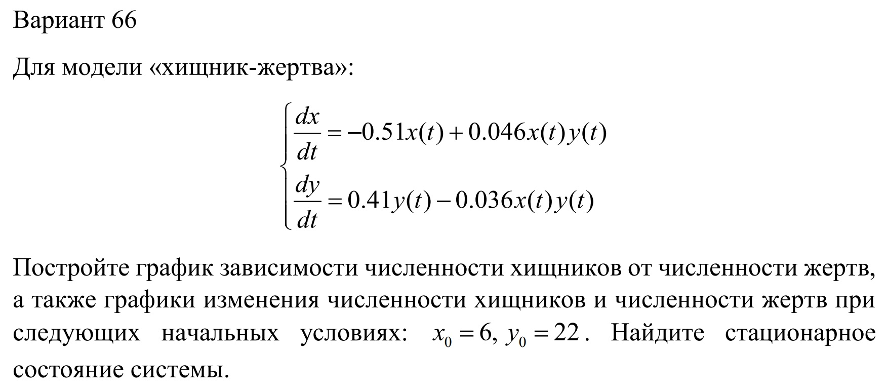{#fig:000 width=70%}

# Теоретическое введение

Простейшая модель взаимодействия двух видов типа «хищник - жертва» — модель Лотки-Вольтерры. Данная двувидовая модель основывается на следующих предположениях:

1. Численность популяции жертв и хищников зависят только от времени.
1. В отсутствии взаимодействия численность видов изменяется по модели Мальтуса, при этом число жертв увеличивается, а число хищников падает.
1. Естественные смертность жертвы и рождаемость хищника считаются несущественными.
1. Эффект насыщения численности обеих популяций не учитывается.
1. Скорость роста численности жертв уменьшается пропорционально численности хищников.
 
Уравнение изменения численности жертв имеет следующий вид: 

(1) $\frac{\mathrm{d} x}{\mathrm{d} t} = ax(t)-bx(t)y(t)$.

Уравнение изменения численности хищников имеет следующий вид: 

(2) $\frac{\mathrm{d} y}{\mathrm{d} t} = -cy(t)+dx(t)y(t)$.

В этой модели $x$ – число жертв, $y$ - число хищников. Коэффициент $a$ описывает скорость естественного прироста числа жертв в отсутствие хищников, $с$ - естественное вымирание хищников, лишенных пищи в виде жертв. Вероятность взаимодействия жертвы и хищника считается пропорциональной как количеству жертв, так и числу самих хищников $(xy)$. Каждый акт взаимодействия уменьшает популяцию жертв $-bxy$, но способствует увеличению популяции хищников $dxy$ в правой части уравнения. 

Математический анализ этой (жесткой) модели показывает, что имеется стационарное состояние, всякое же другое начальное состояние приводит к периодическому колебанию численности как жертв, так и хищников, так что по прошествии некоторого времени система возвращается в начальное состояние. 
Стационарное состояние системы из уравнений (1) и (2) - положение равновесия, не зависящее от времени решение, будет в точке: $x_{0}=\frac{c}{d}$, $y_{0}=\frac{a}{b}$. Если начальные значения задать в стационарном состоянии $x(0)=x_{0}$, $y(0)=y_{0}$, то в любой момент времени численность популяций изменяться не будет. При малом отклонении от положения равновесия численности как хищника, так и жертвы с течением времени не возвращаются к равновесным значениям, а совершают периодические колебания вокруг стационарной точки. Амплитуда колебаний и их период определяется начальными значениями численностей $x(0)$, $y(0)$. Колебания совершаются в противофазе.

Более подробно см. в справочнике на сайте ТУИС на странице курса "Математическое моделирование" [1] [@mm:lab5].

# Выполнение лабораторной работы

1. Написала код задач для модели с заданными начальными условиями - 1, для вычисления стационарного состояния модели - 2, и подготовила результаты для представления на Julia. (рис. @fig:001)

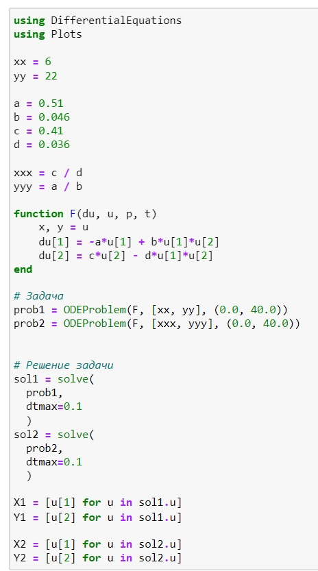{#fig:001 width=70%}

1. Создала график зависимости численности хищников от численности жертв для модели с заданными начальными условиями. (рис. @fig:002)

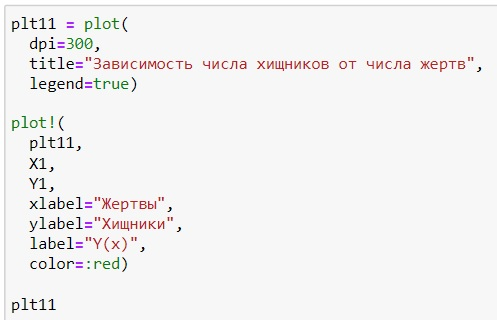{#fig:002 width=70%}

1. Сам график зависимости численности хищников от численности жертв для модели с заданными начальными условиями. (рис. @fig:003)

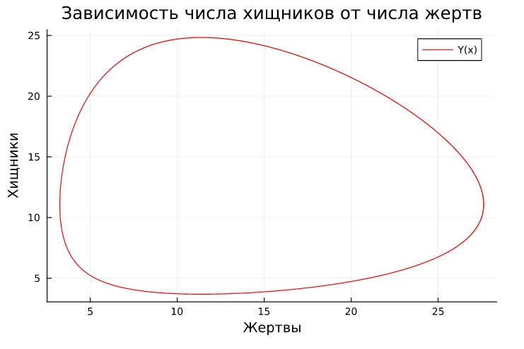{#fig:003 width=70%}

1. Создала график изменения популяций жертв и хищников по времени для модели с заданными начальными условиями. (рис. @fig:004)

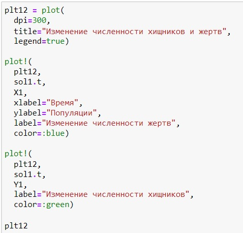{#fig:004 width=70%}

1. Сам график изменения популяций жертв и хищников по времени для модели с заданными начальными условиями. (рис. @fig:005)

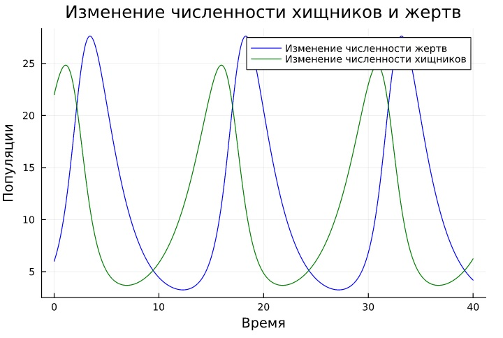{#fig:005 width=70%}

1. Создала график, показывающий отсутствие изменения численности популяций жертв и хищников в стационарном состоянии системы. (рис. @fig:006)

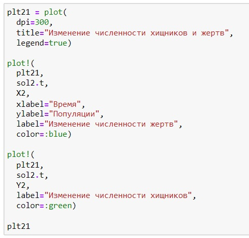{#fig:006 width=70%}

1. Сам график, показывающий отсутствие изменения численности популяций жертв и хищников в стационарном состоянии системы. (рис. @fig:007)

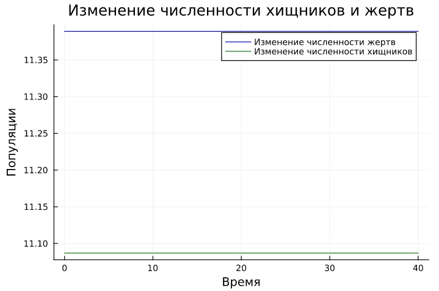{#fig:007 width=70%}

1. Написала код модели с заданными начальными условиями на OpenModelica. (рис. @fig:008)

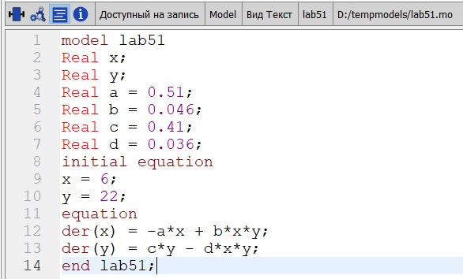{#fig:008 width=70%}

1. Создала график изменения популяций жертв и хищников по времени для модели с заданными начальными условиями. (рис. @fig:009)

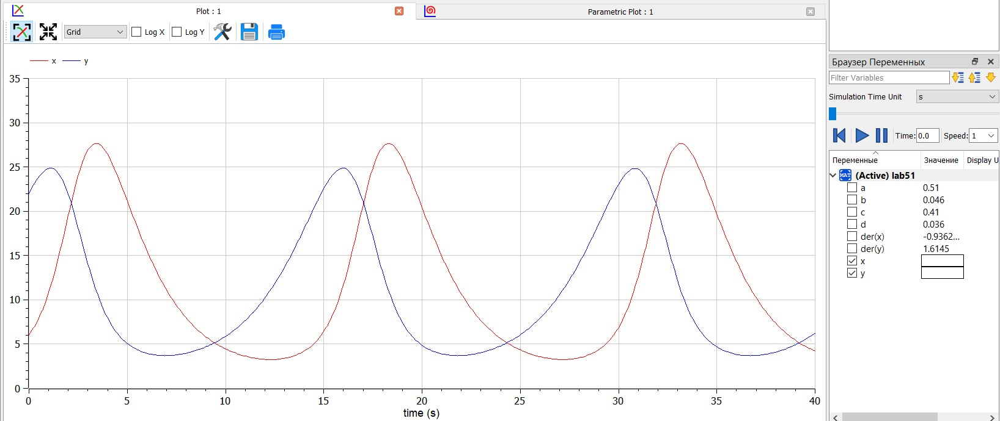{#fig:009 width=70%}

1. Создала график зависимости численности хищников от численности жертв для модели с заданными начальными условиями. (рис. @fig:010)

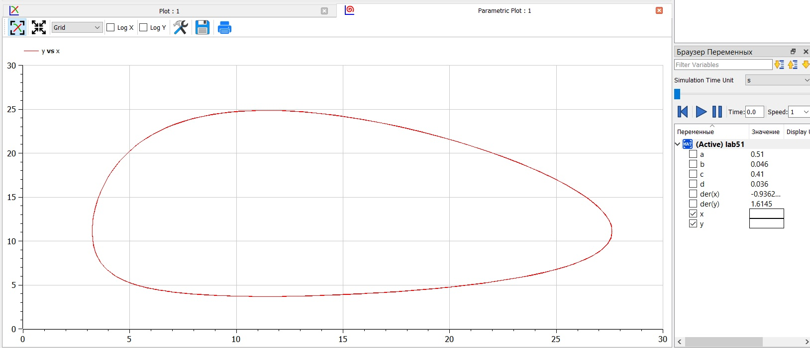{#fig:010 width=70%}

1. Написала код модели в стационарном состоянии на OpenModelica. (рис. @fig:011)

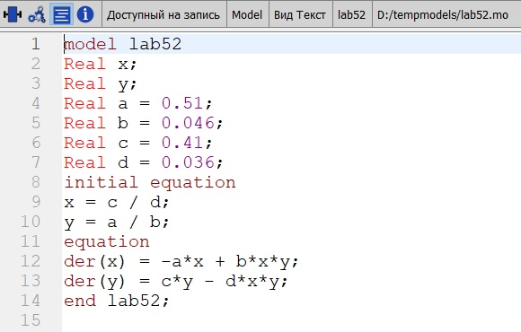{#fig:011 width=70%}

1. Создала график, показывающий отсутствие изменения численности популяций жертв и хищников в стационарном состоянии системы. (рис. @fig:012)

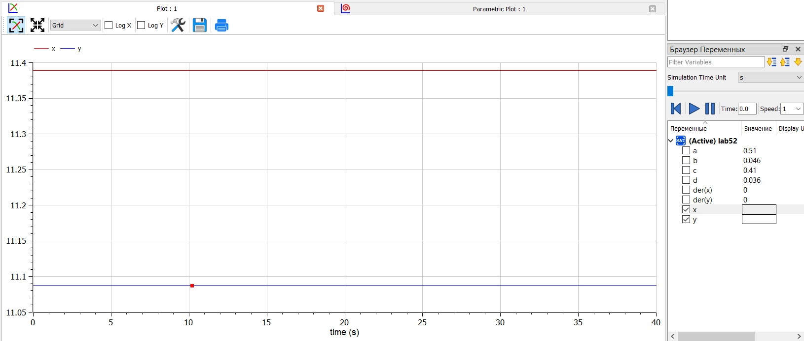{#fig:012 width=70%}

# Сравнение Julia и OpenModelica

Результаты получились одинаковые, однако на Julia можно было строить одновременно модель с разными начальными условиями, в то время как на OpenModelica их необходимо было создавать в отдельных файлах. Также в Julia необходимо было в формате кода задать начальные параметры и создать графики, тогда как на OpenModelica для этого используется графический интерфейс. В связи с этим, код на OpenModelica намного короче, чем на Julia.

# Выводы

В результате работы удалось на Julia и OpenModelica: 

1. создать модель хищник-жертва (модель Лотки-Вольтерры) с заданными параметрами и начальными условиями;
1. найти стационарное состояние системы;
1. построить графики: зависимости численности хищников от численности жертв, изменения популяции хищников и популяции жертв при заданных начальных условиях;
1. показать с помощью графика отсутствие изменений в популяциях хищников и жертв в стационарном состоянии.

# Список литературы{.unnumbered}

[1] Справочная информация для лабораторной работы 5 в ТУИС на курсе "Математическое моделирование" URL: https://esystem.rudn.ru/pluginfile.php/1971660/mod_resource/content/2/%D0%9B%D0%B0%D0%B1%D0%BE%D1%80%D0%B0%D1%82%D0%BE%D1%80%D0%BD%D0%B0%D1%8F%20%D1%80%D0%B0%D0%B1%D0%BE%D1%82%D0%B0%20%E2%84%96%204.pdf.
