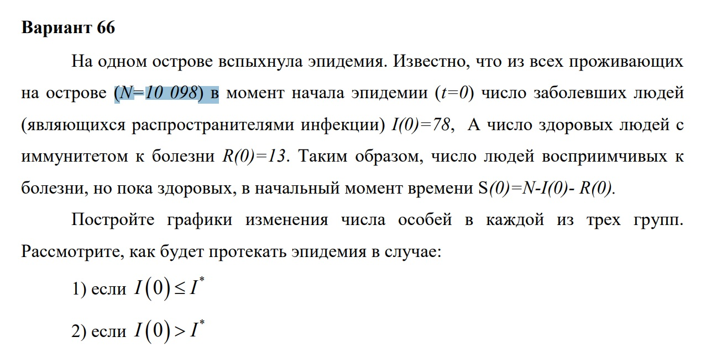
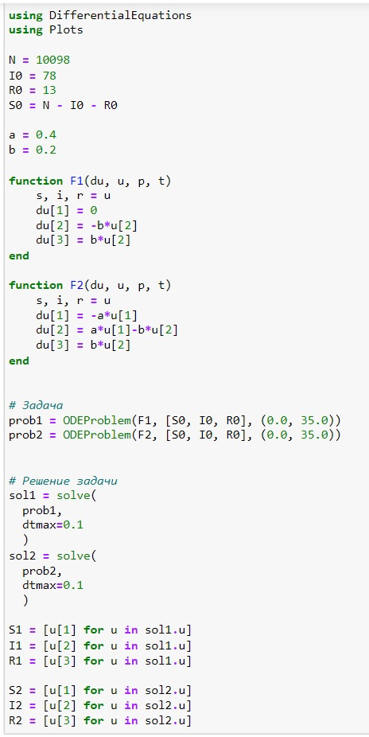
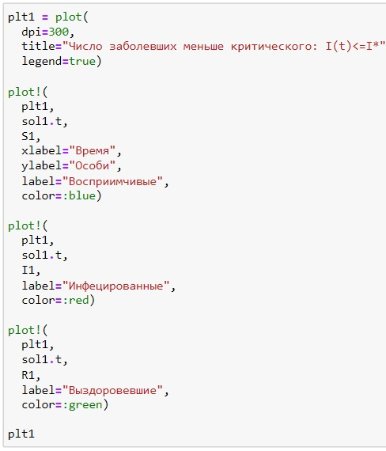
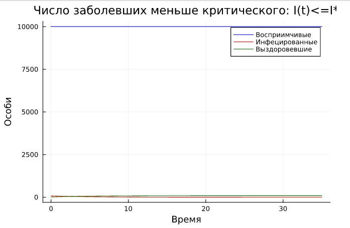
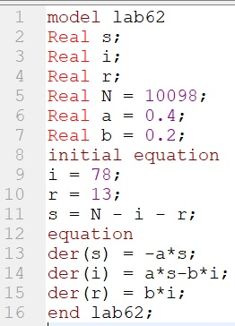
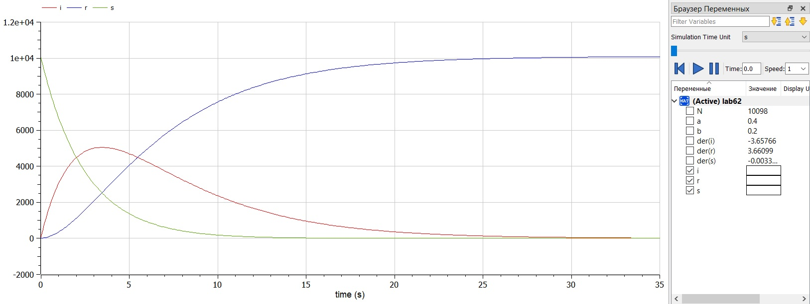

---
## Front matter
lang: ru-RU
title: Презентация к лабораторной работе 6
subtitle: Модель эпидемии SIR
author:
  - Саттарова В. В.
institute:
  - Российский университет дружбы народов, Москва, Россия
date: 18 марта 2023

## i18n babel
babel-lang: russian
babel-otherlangs: english

## Formatting pdf
toc: false
toc-title: Содержание
slide_level: 2
aspectratio: 169
section-titles: true
theme: metropolis
mainfont: PT Serif
romanfont: PT Serif
sansfont: PT Sans
monofont: PT Mono
header-includes:
 - \metroset{progressbar=frametitle,sectionpage=progressbar,numbering=fraction}
 - '\makeatletter'
 - '\beamer@ignorenonframefalse'
 - '\makeatother'
---

# Вводная часть

## Актуальность

Для моделирования распространения инфекционных заболеваний повсеместно используется классическая модель SIR. Она удобна тем, что является простой и базовой для других моделей. Для построения модели эпидемии SIR необходимо решить систему дифференциальных уравнений, которые широко распространены при описании многих естественно научных объектов. Для визуализации результатов необходимо также построить графики. Построение таких моделей и графиков на Julia и OpenModelica - популярных для решения научных задач языках програмирования, позволит получить навыки построения моделей на этих языках с использованием дифференциальных уравнений, а также навыки построения различных графиков. 

## Объект и предмет исследования

Построение модели эпидемии SIR и графиков результатов в двух случаях:

- число инфицированных не превышает критическое значение и больные не заражают восприимчивых;
- число инфицированных превышает критическое значение и больные заражают восприимчивых.

## Цели и задачи

- Построить модель на Julia.
- Построить модель на OpenModelica.
- Проанализировать результаты.

## Материалы и методы

- Julia (REPL)
- Jupiter Notebook (IJulia)
- OpenModelica Connection Editor
- Курс на ТУИС "Математическое моделирование"

# Содержание исследования

## Условие

## Написание кода задачи Julia

## Написание кода для графика Julia

## График Julia

## Написание кода OpenModelica

## График решения OpenModelica

# Результаты работы

- Построена модель эпидемии SIR на Julia и графики изменения по времени количеств восприимчивых, заражённых и выздоровевших в двух случаях: когда число инфицированных не превышает критическое значение и больные не заражают восприимчивых и когда число инфицированных превышает критическое значение и больные заражают восприимчивых.
- Построены модель эпидемии SIR на OpenModelica и графики изменения по времени количеств восприимчивых, заражённых и выздоровевших в двух случаях: когда число инфицированных не превышает критическое значение и больные не заражают восприимчивых и когда число инфицированных превышает критическое значение и больные заражают восприимчивых.
- Было проведено сравнение результатов: результаты идентичны, однако реалиация раздичается в силу особенностей языков.
