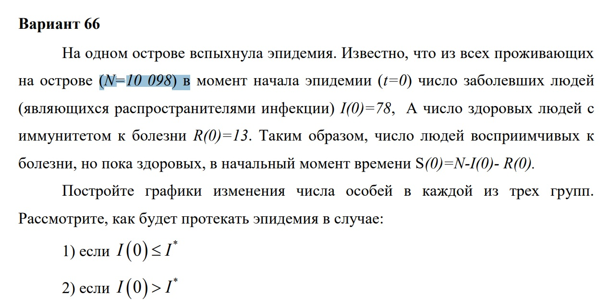
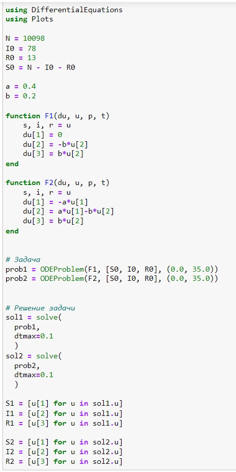
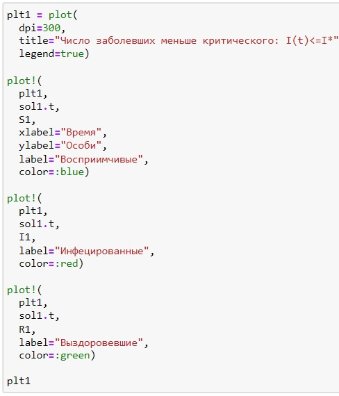
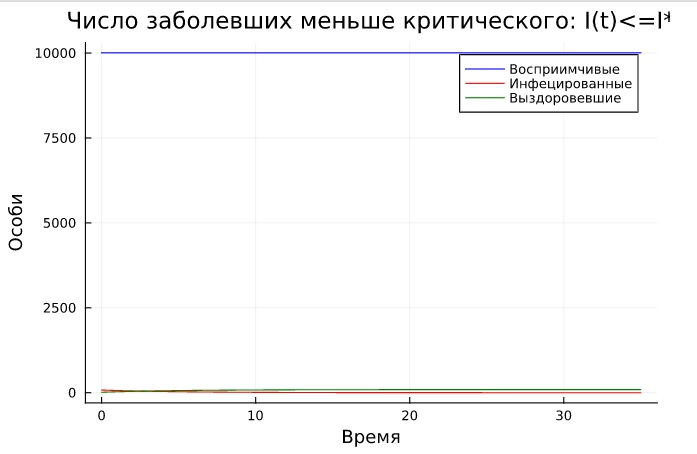
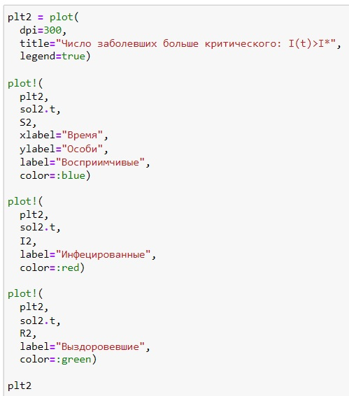
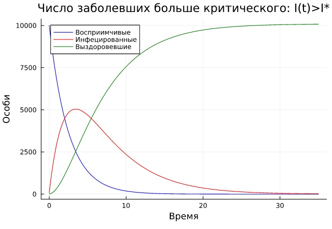
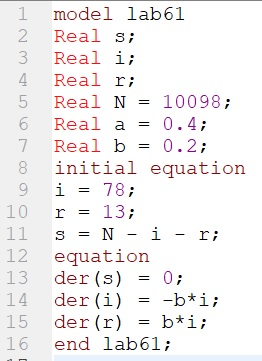
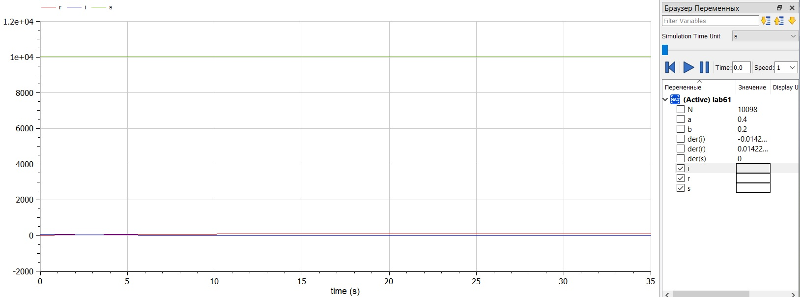
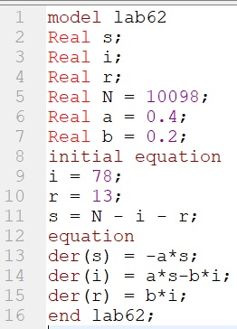
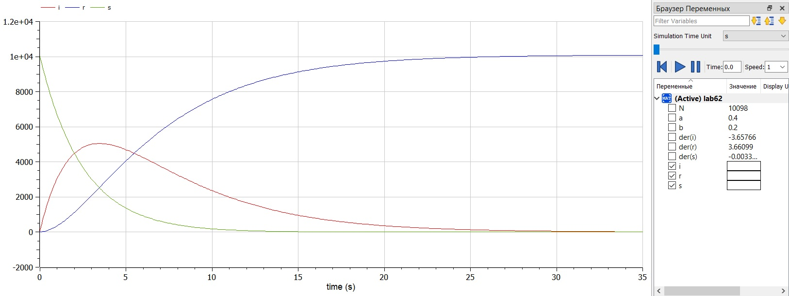

---
## Front matter
title: "Лабораторная работа 6"
subtitle: "Модель эпидемии SIR"
author: "Саттарова Вита Викторовна"

## Generic otions
lang: ru-RU
toc-title: "Содержание"

## Bibliography
bibliography: bib/cite.bib
csl: pandoc/csl/gost-r-7-0-5-2008-numeric.csl

## Pdf output format
toc: true # Table of contents
toc-depth: 2
lof: true # List of figures
lot: true # List of tables
fontsize: 12pt
linestretch: 1.5
papersize: a4
documentclass: scrreprt
## I18n polyglossia
polyglossia-lang:
  name: russian
  options:
	- spelling=modern
	- babelshorthands=true
polyglossia-otherlangs:
  name: english
## I18n babel
babel-lang: russian
babel-otherlangs: english
## Fonts
mainfont: PT Serif
romanfont: PT Serif
sansfont: PT Sans
monofont: PT Mono
mainfontoptions: Ligatures=TeX
romanfontoptions: Ligatures=TeX
sansfontoptions: Ligatures=TeX,Scale=MatchLowercase
monofontoptions: Scale=MatchLowercase,Scale=0.9
## Biblatex
biblatex: true
biblio-style: "gost-numeric"
biblatexoptions:
  - parentracker=true
  - backend=biber
  - hyperref=auto
  - language=auto
  - autolang=other*
  - citestyle=gost-numeric
## Pandoc-crossref LaTeX customization
figureTitle: "Рис."
tableTitle: "Таблица"
listingTitle: "Листинг"
lofTitle: "Список иллюстраций"
lotTitle: "Список таблиц"
lolTitle: "Листинги"
## Misc options
indent: true
header-includes:
  - \usepackage{indentfirst}
  - \usepackage{float} # keep figures where there are in the text
  - \floatplacement{figure}{H} # keep figures where there are in the text
---

# Цель работы

Построить, используя Julia и OpenModelica, модель эпидемии SIR с заданными параметрами, начальными условиями, построить график, отображающий изменение по времени количества восприимчивых, инфецированных и выздоровевших для двух случаев: когда число инфицированных не превышает критическое значение и больные не заражают восприимчивых и когда число инфицированных превышает критическое значение и больные заражают восприимчивых.  

# Задание

**Вариант 66**
Задание. (рис. @fig:000)

{#fig:000 width=70%}

# Теоретическое введение

Рассмотрим простейшую модель эпидемии. Предположим, что некая популяция, состоящая из $N$ особей, (считаем, что популяция изолирована) подразделяется на три группы. Первая группа - это восприимчивые к болезни, но пока здоровые особи, обозначим их через $S(t)$. Вторая группа – это число инфицированных особей, которые также при этом являются распространителями инфекции, обозначим их $I(t)$. А третья группа, обозначающаяся через $R(t)$ – это здоровые особи с иммунитетом к болезни. 

До того, как число заболевших не превышает критического значения $I^{*}$, то есть, $I(t)\leq I^{*}$, считаем, что все больные изолированы и не заражают здоровых. Когда $I(t)>I^{*}$ тогда инфицированные способны заражать восприимчивых к болезни особей. 

Таким образом, скорость изменения числа $S(t)$ меняется по следующему закону:

(1) $\frac{\text{d}S}{\text{d}t}=\begin{cases}-\alpha S, & I(t)>I^{*}\\0, & I(t)\leq I^{*}\end{cases}$

Поскольку каждая восприимчивая к болезни особь, которая, в конце концов, заболевает, сама становится инфекционной, то скорость изменения числа
инфекционных особей $I(t)$ представляет разность за единицу времени между заразившимися и теми, кто уже болеет и лечится, т.е.:

(2) $\frac{\text{d}I}{\text{d}t}=\begin{cases}\alpha S- \beta I, & I(t)>I^{*}\\-\beta I, & I(t)\leq I^{*}\end{cases}$

А скорость изменения выздоравливающих особей $R(t)$ (при этом приобретающих иммунитет к болезни)

(3) $\frac{\text{d}R}{\text{d}t}= \beta I$

Постоянные пропорциональности $\alpha,\beta$ - это коэффициенты заболеваемости и выздоровления соответственно.

Для того, чтобы решения соответствующих уравнений определялось однозначно, необходимо задать начальные условия. Считаем, что на начало
эпидемии в момент времени $t=0$ число особей с иммунитетом к болезни - $R(0)$, число инфицированных - $I(0)$ и число восприимчивых к болезни особей $S(0)$. Для анализа картины протекания эпидемии рассматриваются 2 случая: $I(t)\leq I^{*}$ - когда число заболевших не превышает критического значения и $I(t)>I^{*}$ - когда инфицированные способны заражать восприимчивых к болезни особей.

Более подробно см. в справочнике на сайте ТУИС на странице курса "Математическое моделирование" [1] [@mm:lab6].

# Выполнение лабораторной работы

1. Написала код задач для модели эпидемии SIR для двух случаев: в случае, когда число заболевших не превышает критического значения - 1, в случае, когда число заболевших превышает критическое значение - 2, и подготовила результаты для представления на Julia. (рис. @fig:001)

{#fig:001 width=70%}

1. Создала график изменения по времени количеств восприимчивых, заражённых и выздоровевших в случае, когда число заболевших не превышает критического значения. (рис. @fig:002)

{#fig:002 width=70%}

1. Сам график изменения по времени количеств восприимчивых, заражённых и выздоровевших в первом случае. (рис. @fig:003)

{#fig:003 width=70%}

1. Создала график изменения по времени количеств восприимчивых, заражённых и выздоровевших в случае, когда число заболевших превышает критическое значение. (рис. @fig:004)

{#fig:004 width=70%}

1. Сам график изменения по времени количеств восприимчивых, заражённых и выздоровевших во втором случае. (рис. @fig:005)

{#fig:005 width=70%}

1. Написала код модели эпидемии SIR в случае, когда число заболевших не превышает критического значения на OpenModelica. (рис. @fig:006)

{#fig:006 width=70%}

1. Создала график изменения по времени количеств восприимчивых, заражённых и выздоровевших в первом случае. (рис. @fig:007)

{#fig:007 width=70%}

1. Написала код модели эпидемии SIR в случае, когда число заболевших превышает критическое значение на OpenModelica. (рис. @fig:008)

{#fig:008 width=70%}

1. Создала график изменения по времени количеств восприимчивых, заражённых и выздоровевших во втором случае. (рис. @fig:009)

{#fig:009 width=70%}

# Сравнение Julia и OpenModelica

Результаты получились одинаковые, однако на Julia можно было строить одновременно модель в двух разных случаях, в то время как на OpenModelica их необходимо было создавать в отдельных файлах. Также в Julia необходимо было в формате кода задать начальные параметры и создать графики, тогда как на OpenModelica для этого используется графический интерфейс. В связи с этим, код на OpenModelica намного короче, чем на Julia.

# Выводы

В результате работы удалось на Julia и OpenModelica модель эпидемии SIR с заданными параметрами, начальными условиями, построить график, отображающий изменение по времени количества восприимчивых, инфецированных и выздоровевших для двух случаев: когда число инфицированных не превышает критическое значение и больные не заражают восприимчивых и когда число инфицированных превышает критическое значение и больные заражают восприимчивых. Также в результате работы удалось улучшить навыки решения научных задач на Julia и OpenModelica.

# Список литературы{.unnumbered}

[1] Справочная информация для лабораторной работы 6 в ТУИС на курсе "Математическое моделирование" URL: https://esystem.rudn.ru/pluginfile.php/1971664/mod_resource/content/2/%D0%9B%D0%B0%D0%B1%D0%BE%D1%80%D0%B0%D1%82%D0%BE%D1%80%D0%BD%D0%B0%D1%8F%20%D1%80%D0%B0%D0%B1%D0%BE%D1%82%D0%B0%20%E2%84%96%205.pdf.
