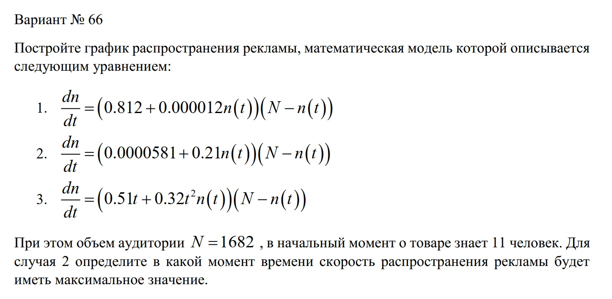
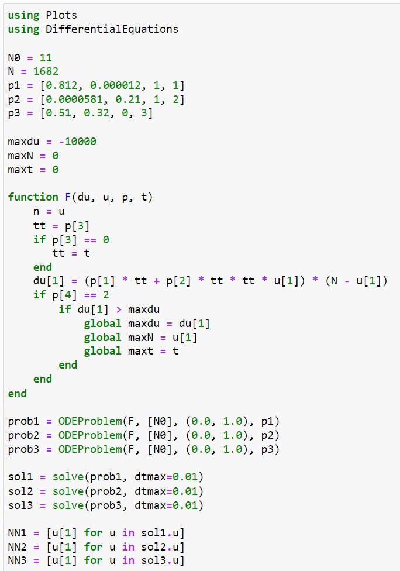
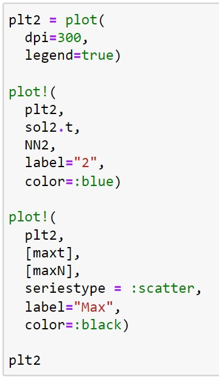
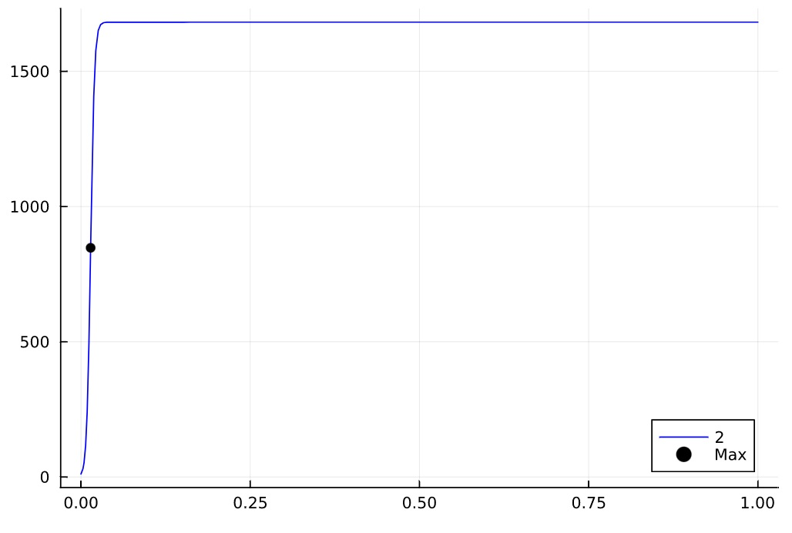
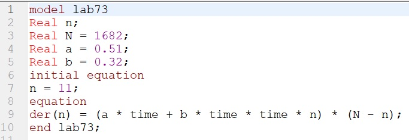
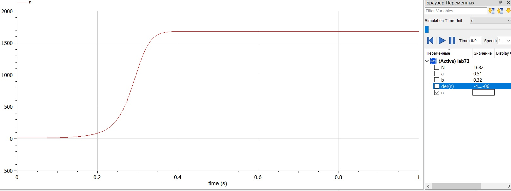

---
## Front matter
lang: ru-RU
title: Презентация к лабораторной работе 7
subtitle: Модель эффективности рекламы
author:
  - Саттарова В. В.
institute:
  - Российский университет дружбы народов, Москва, Россия
date: 25 марта 2023

## i18n babel
babel-lang: russian
babel-otherlangs: english

## Formatting pdf
toc: false
toc-title: Содержание
slide_level: 2
aspectratio: 169
section-titles: true
theme: metropolis
mainfont: PT Serif
romanfont: PT Serif
sansfont: PT Sans
monofont: PT Mono
header-includes:
 - \metroset{progressbar=frametitle,sectionpage=progressbar,numbering=fraction}
 - '\makeatletter'
 - '\beamer@ignorenonframefalse'
 - '\makeatother'
---

# Вводная часть

## Актуальность

Для моделирования эффективности распространения рекламы можно построить модели на основе модели Мальтуса и логистической функции. Такие модели удобны тем, что являются простыми и базовыми для изучения эффективности распространения рекламы. Для построения этих моделей необходимо решить дифференциальное уравнение, которые широко распространены при описании многих естественно научных объектов. Для визуализации результатов необходимо также построить графики. Построение таких моделей и графиков на Julia и OpenModelica - популярных для решения научных задач языках програмирования, позволит получить навыки построения моделей на этих языках с использованием дифференциальных уравнений, а также навыки построения различных графиков. 

## Объект и предмет исследования

Построение 3 моделей эффективности распространения рекламы:

- с высокой интенсивностью рекламной кампании и низким распространением рекламы потребителями; 
- с низкой интенсивностью рекламной кампании и высоким распространением рекламы потребителями с нахождением момента времени, в который скорость распространения рекламы максимальна; 
- с высокой интенсивностью рекламной кампании, высоким распространением рекламы потребителями и постоянно изменяющимися коэффициентами. 

## Цели и задачи

- Построить модель на Julia.
- Построить модель на OpenModelica.
- Проанализировать результаты.

## Материалы и методы

- Julia (REPL)
- Jupiter Notebook (IJulia)
- OpenModelica Connection Editor
- Курс на ТУИС "Математическое моделирование"

# Содержание исследования

## Условие

## Написание кода задачи Julia

## Написание кода для графика Julia

## График Julia

## Написание кода OpenModelica

## График решения OpenModelica

# Результаты работы

- Построены модели эффективности распространения рекламы: с высокой интенсивностью рекламной кампании и низким распространением рекламы потребителями; с низкой интенсивностью рекламной кампании и высоким распространением рекламы потребителями; с высокой интенсивностью рекламной кампании, высоким распространением рекламы потребителями и постоянно изменяющимися коэффициентами;
- Для второго случая был найден момент времени, в который скорость распространения рекламы максимальна;
- Были построены графики распространения рекламы для визуализации эффективности рекламы;
- Было проведено сравнение результатов: результаты идентичны, однако реалиация раздичается в силу особенностей языков.
