---
## Front matter
title: "Лабораторная работа 7"
subtitle: "Эффективность рекламы"
author: "Саттарова Вита Викторовна"

## Generic otions
lang: ru-RU
toc-title: "Содержание"

## Bibliography
bibliography: bib/cite.bib
csl: pandoc/csl/gost-r-7-0-5-2008-numeric.csl

## Pdf output format
toc: true # Table of contents
toc-depth: 2
lof: true # List of figures
lot: true # List of tables
fontsize: 12pt
linestretch: 1.5
papersize: a4
documentclass: scrreprt
## I18n polyglossia
polyglossia-lang:
  name: russian
  options:
	- spelling=modern
	- babelshorthands=true
polyglossia-otherlangs:
  name: english
## I18n babel
babel-lang: russian
babel-otherlangs: english
## Fonts
mainfont: PT Serif
romanfont: PT Serif
sansfont: PT Sans
monofont: PT Mono
mainfontoptions: Ligatures=TeX
romanfontoptions: Ligatures=TeX
sansfontoptions: Ligatures=TeX,Scale=MatchLowercase
monofontoptions: Scale=MatchLowercase,Scale=0.9
## Biblatex
biblatex: true
biblio-style: "gost-numeric"
biblatexoptions:
  - parentracker=true
  - backend=biber
  - hyperref=auto
  - language=auto
  - autolang=other*
  - citestyle=gost-numeric
## Pandoc-crossref LaTeX customization
figureTitle: "Рис."
tableTitle: "Таблица"
listingTitle: "Листинг"
lofTitle: "Список иллюстраций"
lotTitle: "Список таблиц"
lolTitle: "Листинги"
## Misc options
indent: true
header-includes:
  - \usepackage{indentfirst}
  - \usepackage{float} # keep figures where there are in the text
  - \floatplacement{figure}{H} # keep figures where there are in the text
---

# Цель работы

Построить, используя Julia и OpenModelica, 3 модели эффективности распространения рекламы с различными заданными параметрами, начальными условиями, построить для каждой модели графики распространения рекламы, для одного из случаев найти момент времени, в который скорость распространения рекламы максимальна.  

# Задание

**Вариант 66**
Задание. (рис. @fig:000)

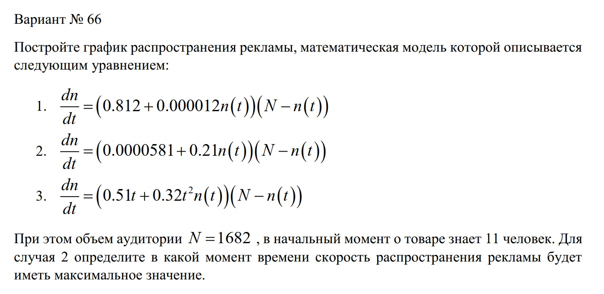{#fig:000 width=70%}

# Теоретическое введение

Организуется рекламная кампания нового товара или услуги. Необходимо, чтобы прибыль будущих продаж с избытком покрывала издержки на рекламу.
Вначале расходы могут превышать прибыль, поскольку лишь малая часть потенциальных покупателей будет информирована о новинке. Затем, при увеличении числа продаж, возрастает и прибыль, и, наконец, наступит момент, когда рынок насытиться, и рекламировать товар станет бесполезным. Предположим, что торговыми учреждениями реализуется некоторая продукция, о которой в момент времени $t$ из числа потенциальных покупателей $N$ знает лишь $n$ покупателей. Для ускорения сбыта продукции запускается реклама по радио, телевидению и других средств массовой информации. После запуска рекламной кампании информация о продукции начнет распространяться среди потенциальных покупателей путем общения друг с другом. Таким образом, после запуска рекламных объявлений скорость изменения числа знающих о продукции людей пропорциональна как числу знающих о товаре покупателей, так и числу покупателей о нем не знающих.

Модель рекламной кампании описывается следующими величинами. Считаем, что $\frac{\text{d}n}{\text{d}t}$ - скорость изменения со временем числа потребителей, узнавших о товаре и готовых его купить, $t$ - время, прошедшее с начала рекламной кампании, $n(t)$ - число уже информированных клиентов. Эта величина
пропорциональна числу покупателей, еще не знающих о нем, это описывается следующим образом: $a_{1}\left(t\right)\left(N-n\left(t\right)\right)$, где $N$ - общее число потенциальных платежеспособных покупателей, $a_{1}\left(t\right)>0$ - характеризует интенсивность рекламной кампании (зависит от затрат на рекламу в данный момент времени). Помимо этого, узнавшие о товаре потребители также распространяют полученную информацию среди потенциальных покупателей, не знающих о нем. Этот вклад в рекламу описывается величиной $a_{2}\left(t\right)n\left(t\right)\left(N-n\left(t\right)\right)$, эта величина увеличивается с увеличением потребителей узнавших о товаре. Математическая модель распространения рекламы описывается уравнением:

(1) \frac{\text{d}n}{\text{d}t}=\left(a_{1}\left(t\right)+a_{2}\left(t\right)n\left(t\right)\right)\left(N-n\left(t\right)\right)

При $a_{1}\left(t\right)\gg a_{2}\left(t\right)$ получается модель типа модели Мальтуса. В обратном случае, при $a_{1}\left(t\right)\ll a_{2}\left(t\right)$ получаем уравнение логистической кривой.

Более подробно см. в справочнике на сайте ТУИС на странице курса "Математическое моделирование" [1] [@mm:lab7](https://github.com/vvsattarova/study_2022-2023_mathmod/blob/master/labs/lab07/report/bib/cite.bib).

Мальтузианская модель роста (англ. Malthusian growth model), также называемая моделью Мальтуса отражает экспоненциальный рост с постоянным темпом. В мальтузианских моделях наиболее важными являются параметры исходной численности, темп прироста и время [2] [@mm:malthus](https://github.com/vvsattarova/study_2022-2023_mathmod/blob/master/labs/lab07/report/bib/cite.bib).

Логистическая функция или логистическая кривая - самая общая сигмоидальная (S-образная) кривая. Она моделирует кривую роста вероятности некоего события, по мере изменения управляющих параметров (факторов риска). Вероятность P можно также трактовать как заселенность. Начальная стадия роста логистической кривой приблизительно соответствует экспоненте (показательная функция). Затем, по мере насыщения, рост замедляется, проходит линейную фазу и, наконец, и в зрелом периоде практически останавливается [3] [@mm:logistic](https://github.com/vvsattarova/study_2022-2023_mathmod/blob/master/labs/lab07/report/bib/cite.bib).

# Выполнение лабораторной работы

1. Написала код задач для всех моделей: 
- 1 - модель распространения рекламы с высокой интенсивностью рекламной кампании и низким распространением рекламы потребителями; 
- 2 - модель распространения рекламы с низкой интенсивностью рекламной кампании и высоким распространением рекламы потребителями с нахождением момента времени, в который скорость распространения рекламы максимальна; 
- 3 - модель распространения рекламы с высокой интенсивностью рекламной кампании, высоким распространением рекламы потребителями и постоянно изменяющимися коэффициентами. 
Подготовила результаты для представления на Julia. (рис. @fig:001)

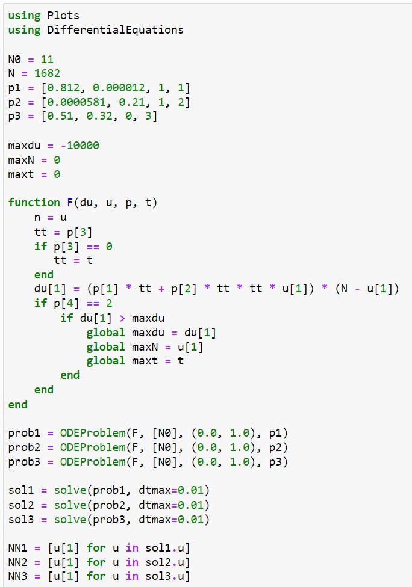{#fig:001 width=70%}

2. Создала график для модели 1. (рис. @fig:002)

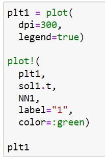{#fig:002 width=70%}

3. Сам график для модели распространения рекламы с высокой интенсивностью рекламной кампании и низким распространением рекламы потребителями. (рис. @fig:003)

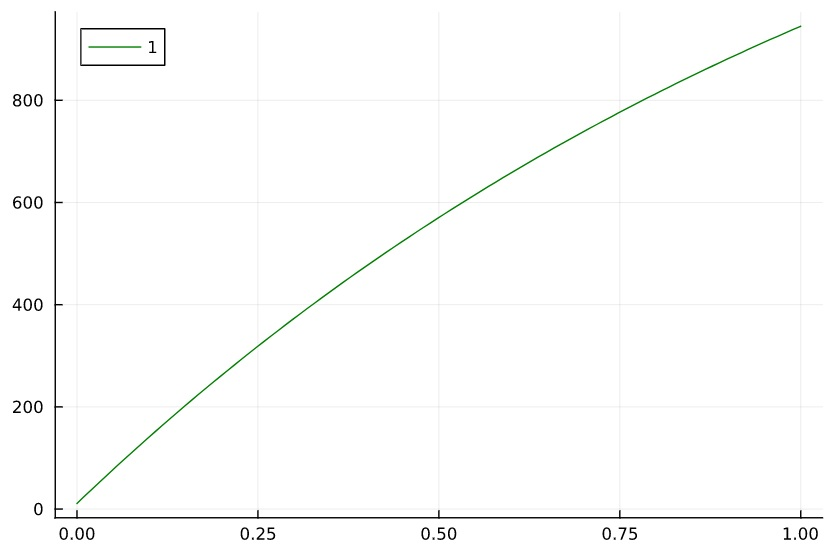{#fig:003 width=70%}

4. Создала график для модели 2 с указанием момента времени, в который скорость распространения рекламы максимальна. (рис. @fig:004)

{#fig:004 width=70%}

5. Сам график для модели распространения рекламы с низкой интенсивностью рекламной кампании и высоким распространением рекламы потребителями с указанным моментом времени. (рис. @fig:005)

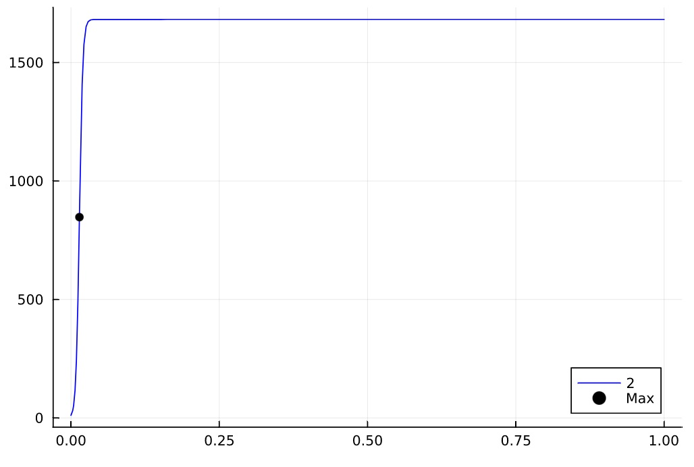{#fig:005 width=70%}

6. Создала график для модели 3. (рис. @fig:006)

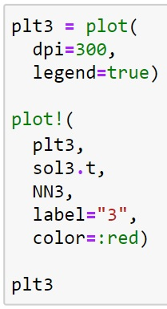{#fig:006 width=70%}

7. Сам график для модели распространения рекламы с высокой интенсивностью рекламной кампании, высоким распространением рекламы потребителями и постоянно изменяющимися коэффициентами. (рис. @fig:007)

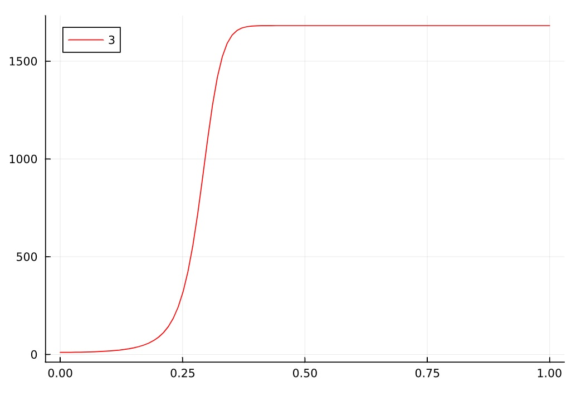{#fig:007 width=70%}

8. Написала код модели 1 на OpenModelica. (рис. @fig:008)

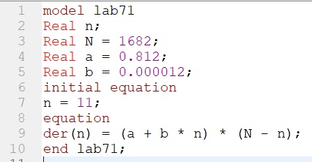{#fig:008 width=70%}

9. Создала график распространения рекламы для модели 1. (рис. @fig:009)

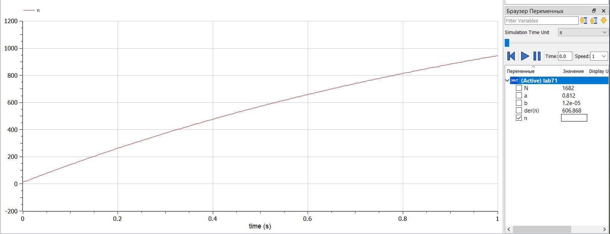{#fig:009 width=70%}

10. Написала код модели 2 на OpenModelica. (рис. @fig:010)

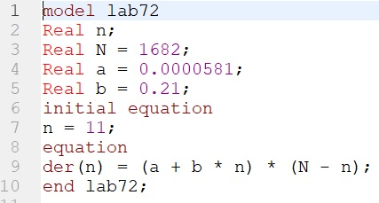{#fig:010 width=70%}

11. Создала график распространения рекламы для модели 2. (рис. @fig:011)

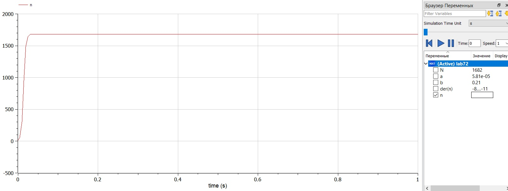{#fig:011 width=70%}

12. Написала код модели 3 на OpenModelica. (рис. @fig:012)

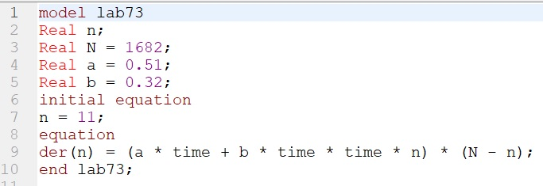{#fig:012 width=70%}

13. Создала график распространения рекламы для модели 3. (рис. @fig:013)

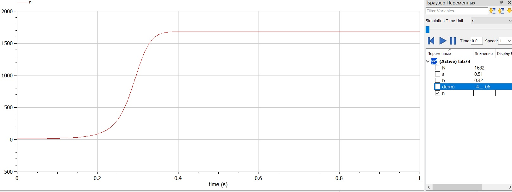{#fig:013 width=70%}

# Сравнение Julia и OpenModelica

Результаты получились одинаковые, однако на Julia можно было строить одновременно 3 модели, в то время как на OpenModelica их необходимо было создавать в отдельных файлах. Также в Julia необходимо было в формате кода задать начальные параметры и создать графики, тогда как на OpenModelica для этого используется графический интерфейс. В связи с этим, код на OpenModelica намного короче, чем на Julia.

# Выводы

В результате работы удалось создать 3 модели распространения рекламы: с высокой интенсивностью рекламной кампании и низким распространением рекламы потребителями, с низкой интенсивностью рекламной кампании и высоким распространением рекламы потребителями, с высокой интенсивностью рекламной кампании, высоким распространением рекламы потребителями и постоянно изменяющимися коэффициентами; для 2 модели также был найден момент времени, в который скорость распространения рекламы максимальна; удалось построить графики распространения рекламы на Julia и OpenModelica.  Также в результате работы удалось улучшить навыки решения научных задач на Julia и OpenModelica.

# Список литературы{.unnumbered}

[1] Справочная информация для лабораторной работы 3 в ТУИС на курсе "Математическое моделирование", дата обращения: 25.03.2023, [@mm:lab7](https://github.com/vvsattarova/study_2022-2023_mathmod/blob/master/labs/lab07/report/bib/cite.bib) 

URL: https://esystem.rudn.ru/pluginfile.php/1971668/mod_resource/content/2/%D0%9B%D0%B0%D0%B1%D0%BE%D1%80%D0%B0%D1%82%D0%BE%D1%80%D0%BD%D0%B0%D1%8F%20%D1%80%D0%B0%D0%B1%D0%BE%D1%82%D0%B0%20%E2%84%96%206.pdf.

[2] Мальтузианская модель роста, дата обращения: 25.03.2023, [@mm:malthus](https://github.com/vvsattarova/study_2022-2023_mathmod/blob/master/labs/lab07/report/bib/cite.bib)  

URL: https://ru.wikipedia.org/wiki/%D0%9C%D0%B0%D0%BB%D1%8C%D1%82%D1%83%D0%B7%D0%B8%D0%B0%D0%BD%D1%81%D0%BA%D0%B0%D1%8F_%D0%BC%D0%BE%D0%B4%D0%B5%D0%BB%D1%8C_%D1%80%D0%BE%D1%81%D1%82%D0%B0.

[3] Логистическая функция, дата обращения: 25.03.2023, [@mm:logistic](https://github.com/vvsattarova/study_2022-2023_mathmod/blob/master/labs/lab07/report/bib/cite.bib)  
URL: http://www.machinelearning.ru/wiki/index.php?title=%D0%9B%D0%BE%D0%B3%D0%B8%D1%81%D1%82%D0%B8%D1%87%D0%B5%D1%81%D0%BA%D0%B0%D1%8F_%D1%84%D1%83%D0%BD%D0%BA%D1%86%D0%B8%D1%8F.
