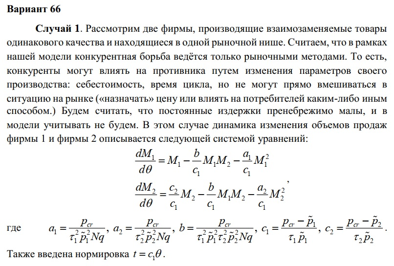
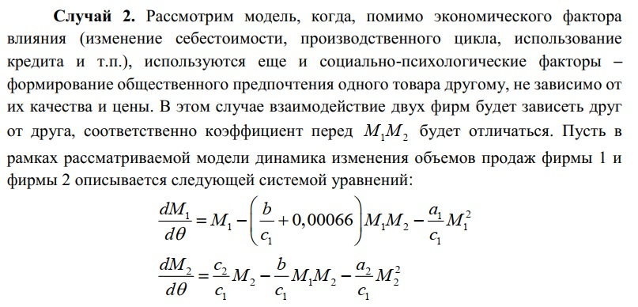
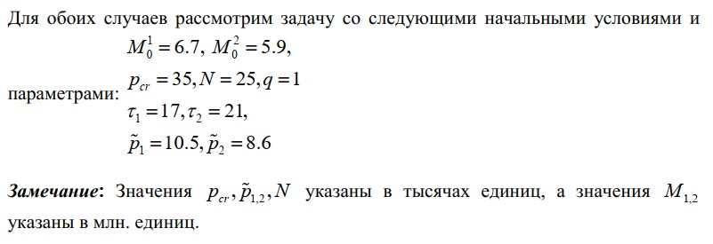
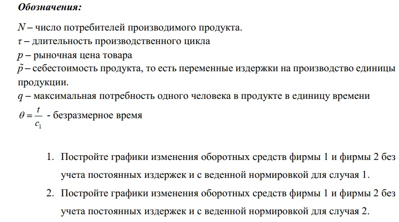
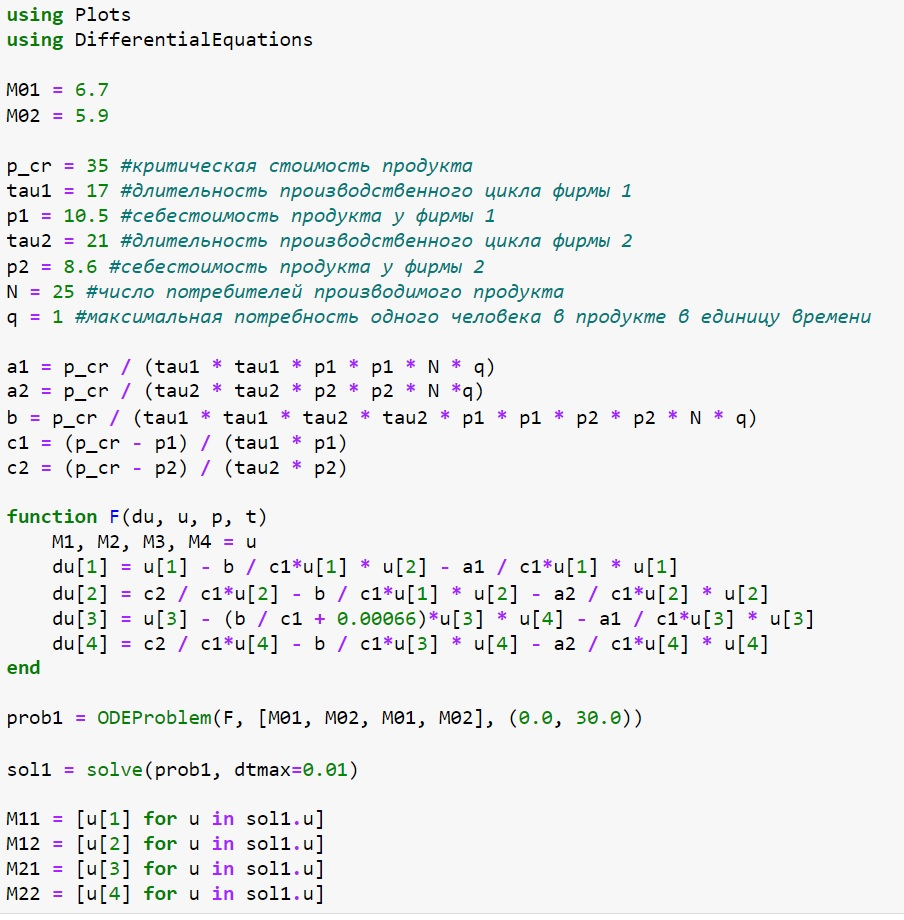
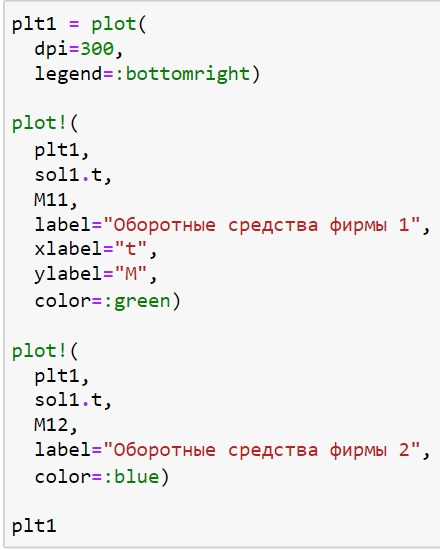
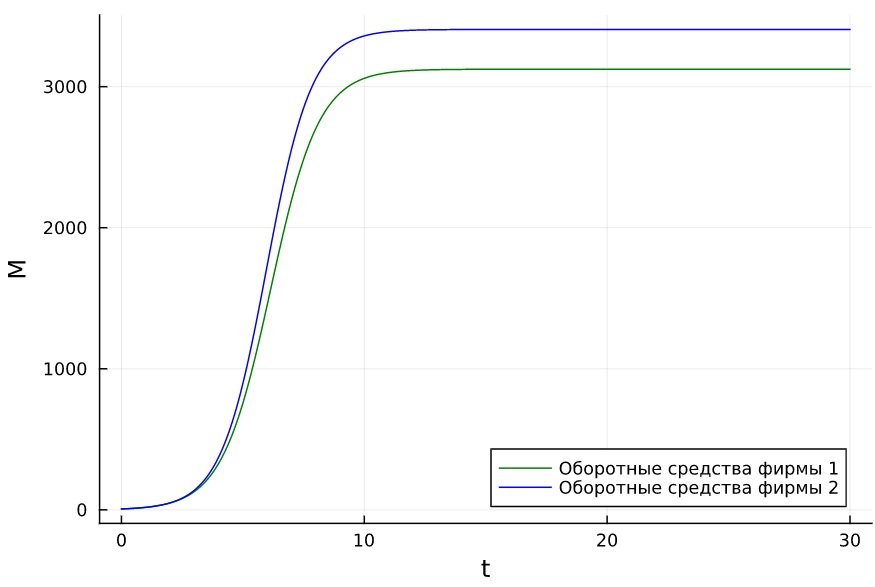
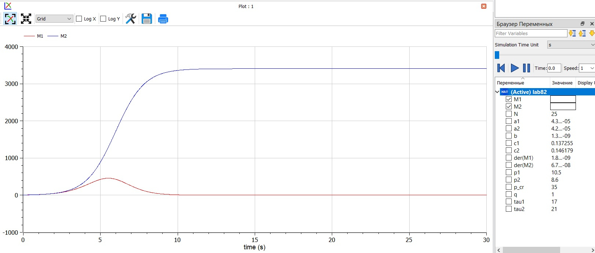

---
## Front matter
lang: ru-RU
title: Презентация к лабораторной работе 8
subtitle: Модель конкуренции двух фирм
author:
  - Саттарова В. В.
institute:
  - Российский университет дружбы народов, Москва, Россия
date: 1 апреля 2023

## i18n babel
babel-lang: russian
babel-otherlangs: english

## Formatting pdf
toc: false
toc-title: Содержание
slide_level: 2
aspectratio: 169
section-titles: true
theme: metropolis
mainfont: PT Serif
romanfont: PT Serif
sansfont: PT Sans
monofont: PT Mono
header-includes:
 - \metroset{progressbar=frametitle,sectionpage=progressbar,numbering=fraction}
 - '\makeatletter'
 - '\beamer@ignorenonframefalse'
 - '\makeatother'
---

# Вводная часть

## Актуальность

Для моделирования конкуренции двух фирм можно построить упрощённую модель, которая дает модельное решение, используя минимальное количество необходимых факторов, влияющих на динамику изменения оборотных средств предприятий. Такая модель удобна тем, что является простой и базовой для изучения конкуренции фирм. Для построения этой моделей необходимо решить систему дифференциальных уравнений, которые широко распространены при описании многих естественно научных объектов. Для визуализации результатов необходимо также построить графики. Построение таких моделей и графиков на Julia и OpenModelica - популярных для решения научных задач языках програмирования, позволит получить навыки построения моделей на этих языках с использованием систем дифференциальных уравнений, а также навыки построения различных графиков. 

## Объект и предмет исследования

Построение модели конкуренции двух фирм для двух случаев:

- **случай 1** -  конкурентная борьба ведётся только рыночными методами; 
- **случай 2** -  конкурентная борьба ведётся рыночными методами с учётом социально-психологических факторов.

## Цели и задачи

- Построить модель на Julia.
- Построить модель на OpenModelica.
- Проанализировать результаты.

## Материалы и методы

- Julia (REPL)
- Jupiter Notebook (IJulia)
- OpenModelica Connection Editor
- Курс на ТУИС "Математическое моделирование"

# Содержание исследования

## Условие случая 1

## Условие случая 2

## Условие начальные условия

## Условие задание

## Написание кода задачи Julia

## Написание кода для графика Julia

## График Julia

## Написание кода OpenModelica

## График решения OpenModelica

# Результаты работы

- Построена модель конкуренции двух фирм для двух случаев: конкурентная борьба ведётся только рыночными методами и конкурентная борьба ведётся рыночными методами с учётом социально-психологических факторов;
- Были построены графики изменения оборотных средств фирмы 1 и фирмы 2 без учета постоянных издержек и с веденной нормировкой для обоих случаев на Julia и OpenModelica;
- Было проведено сравнение результатов: результаты идентичны, однако реалиация раздичается в силу особенностей языков.
