---
## Front matter
title: "Лабораторная работа 8"
subtitle: "Модель конкуренции двух фирм"
author: "Саттарова Вита Викторовна"

## Generic otions
lang: ru-RU
toc-title: "Содержание"

## Bibliography
bibliography: bib/cite.bib
csl: pandoc/csl/gost-r-7-0-5-2008-numeric.csl

## Pdf output format
toc: true # Table of contents
toc-depth: 2
lof: true # List of figures
lot: true # List of tables
fontsize: 12pt
linestretch: 1.5
papersize: a4
documentclass: scrreprt
## I18n polyglossia
polyglossia-lang:
  name: russian
  options:
	- spelling=modern
	- babelshorthands=true
polyglossia-otherlangs:
  name: english
## I18n babel
babel-lang: russian
babel-otherlangs: english
## Fonts
mainfont: PT Serif
romanfont: PT Serif
sansfont: PT Sans
monofont: PT Mono
mainfontoptions: Ligatures=TeX
romanfontoptions: Ligatures=TeX
sansfontoptions: Ligatures=TeX,Scale=MatchLowercase
monofontoptions: Scale=MatchLowercase,Scale=0.9
## Biblatex
biblatex: true
biblio-style: "gost-numeric"
biblatexoptions:
  - parentracker=true
  - backend=biber
  - hyperref=auto
  - language=auto
  - autolang=other*
  - citestyle=gost-numeric
## Pandoc-crossref LaTeX customization
figureTitle: "Рис."
tableTitle: "Таблица"
listingTitle: "Листинг"
lofTitle: "Список иллюстраций"
lotTitle: "Список таблиц"
lolTitle: "Листинги"
## Misc options
indent: true
header-includes:
  - \usepackage{indentfirst}
  - \usepackage{float} # keep figures where there are in the text
  - \floatplacement{figure}{H} # keep figures where there are in the text
---

# Цель работы

Построить, используя Julia и OpenModelica, модель конкуренции двух фирм для двух случаев с заданными параметрами, начальными условиями, построить для каждого случая графики изменения оборотных средств фирмы 1 и фирмы 2 без учета постоянных издержек и с веденной нормировкой.  

# Задание

**Вариант 66**
Задание:

- Случай 1 (рис. @fig:101)

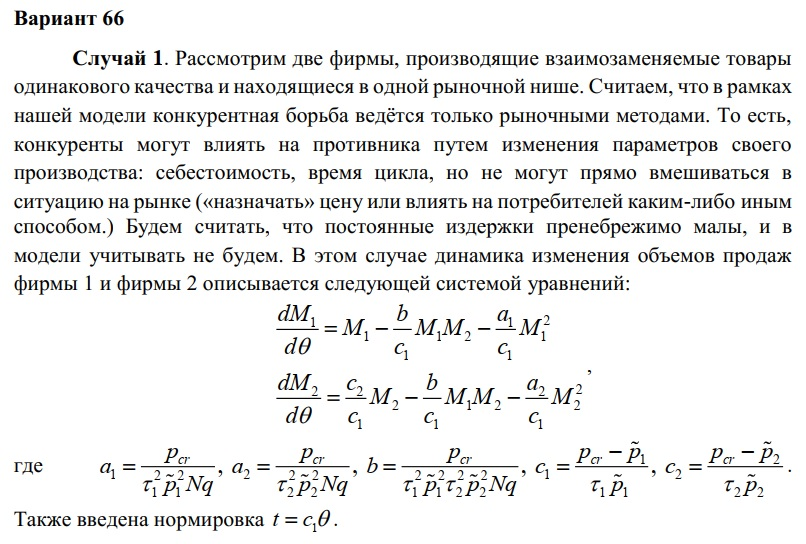{#fig:101 width=70%}

- Случай 2 (рис. @fig:102)

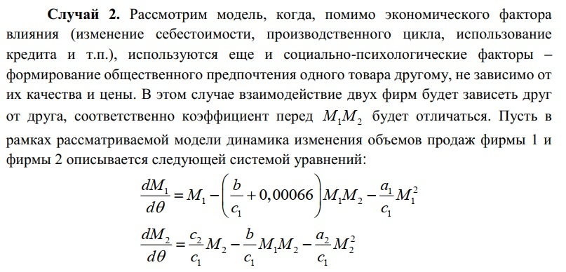{#fig:102 width=70%}

- Начальные значения и замечание (рис. @fig:103)

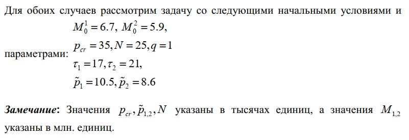{#fig:103 width=70%}

- Обозначения и задание (рис. @fig:104)

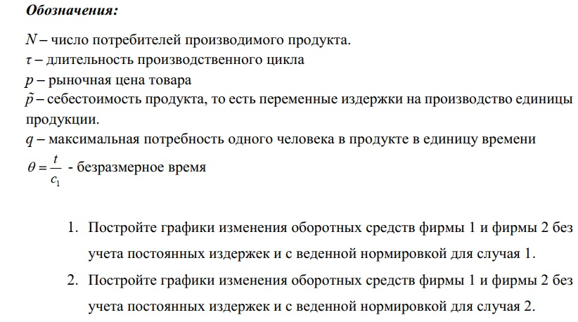{#fig:104 width=70%}

# Теоретическое введение

Для построения модели конкуренции хотя бы двух фирм необходимо рассмотреть модель одной фирмы. Вначале рассмотрим модель фирмы, производящей продукт долговременного пользования, когда цена его определяется балансом спроса и предложения. Примем, что этот продукт занимает определенную нишу рынка и конкуренты в ней отсутствуют. 

Обозначим:

- $N$ - число потребителей производимого продукта. 
- $S$ – доходы потребителей данного продукта. Считаем, что доходы всех потребителей одинаковы. Это предположение справедливо, если речь идет об одной рыночной нише, т.е. производимый продукт ориентирован на определенный слой населения. 
- $M$ – оборотные средства предприятия 
- $\tau$ - длительность производственного цикла
- $p$ - рыночная цена товара 
- $\tilde{p}$ - себестоимость продукта, то есть переменные издержки на производство единицы продукции
- $\delta$ - доля оборотных средств, идущая на покрытие переменных издержек
- $k$ - постоянные издержки, которые не зависят от количества выпускаемой продукции
- $Q(S/p)$ – функция спроса, зависящая от отношения дохода $S$ к цене $p$. Она равна количеству продукта, потребляемого одним потребителем в единицу времени.

Функцию спроса товаров долговременного использования часто представляют в простейшей форме: 

(1) $$Q = q - k\frac{p}{S} = q(1 - \frac{p}{p_{cr}})$$

где $q$ – максимальная потребность одного человека в продукте в единицу времени.
Эта функция падает с ростом цены и при $p = p_{cr}$ (критическая стоимость продукта) потребители отказываются от приобретения товара. Величина $p_{cr} = Sq/k$. Параметр $k$ – мера эластичности функции спроса по цене. Таким образом, функция спроса в форме (1) является пороговой (то есть, $Q(S/p) = 0$ при $p \geq p_{cr}$) и обладает свойствами насыщения.

Уравнения динамики оборотных средств можно записать в виде:

(2) $$\frac{dM}{dt} = -\frac{M \delta}{\tau} + NQp - k = -\frac{M\delta}{\tau} + Nq(1 - \frac{p}{p_{cr}})p - k$$

Уравнение для рыночной цены $p$ представим в виде:

(3) $$\frac{dp}{dt} = \gamma (-\frac{M\delta}{\tau \tilde{p}} + Nq(1-\frac{p}{p_{cr}}) )$$

Первый член соответствует количеству поставляемого на рынок товара (то есть, предложению), а второй член – спросу.
Параметр $\gamma$ зависит от скорости оборота товаров на рынке. Как правило, время торгового оборота существенно меньше времени производственного цикла $\tau$. При заданном M уравнение (3) описывает быстрое стремление цены к равновесному значению цены, которое устойчиво.

В этом случае уравнение (3) можно заменить алгебраическим соотношением

(4) $$ -\frac{M\delta}{\tau \tilde{p}} + Nq(1-\frac{p}{p_{cr}}) = 0$$

Из (4) следует, что равновесное значение цены $p$ равно

(5) $$ p = p_{cr}(1 - \frac{M\delta}{\tau \tilde{p} Nq})$$

Уравнение (2) с учётом (5) приобретает вид

(6) $$\frac{dM}{dt} = -\frac{M \delta}{\tau}(\frac{p}{p_{cr}}-1) - M^2 ( \frac{\delta}{\tau \tilde{p} })^2 \frac{p_{cr}}{Nq} - k$$

Уравнение (6) имеет два стационарных решения, соответствующих условию $dM/dt=0$

(7) $$ \tilde{M_{1,2}} = \frac{1}{2} a \pm \sqrt{\frac{a^2}{4} - b}$$

где

(8) $$ a = Nq(1 - \frac{\tilde{p}}{p_{cr}} \tilde{p} \frac{\tau}{\delta}), b = kNq \frac{(\tau \tilde{p})^2}{p_{cr}\delta ^2} $$

Из (7) следует, что при больших постоянных издержках (в случае $a^2 < 4b$) стационарных состояний нет. Это означает, что в этих условиях фирма не может функционировать стабильно, то есть, терпит банкротство. Однако, как правило, постоянные затраты малы по сравнению с переменными (то есть, $b << a^2$) и играют роль, только в случае, когда оборотные средства малы. 

При $b << a$ стационарные значения $M$ равны

(9) $$ \tilde{M_{+}} = Nq \frac{\tau}{\delta}(1 - \frac{\tilde{p}}{p_{cr}})\tilde{p}, \tilde{M_{-}} = k\tilde{p} \frac{\tau}{\delta(p_{cr} - \tilde{p})} $$

Первое состояние $\tilde{M_{+}}$ устойчиво и соответствует стабильному функционированию предприятия. Второе состояние $\tilde{M_{-}$ неустойчиво, так, что при $M < \tilde{M_{-}}$ оборотные средства падают ($dM/dt < 0$), то есть, фирма идет к банкротству. По смыслу $\tilde{M_{-}}$ соответствует начальному капиталу, необходимому для входа в рынок.

В обсуждаемой модели параметр $\delta$ всюду входит в сочетании с $\tau$. Это значит, что уменьшение доли оборотных средств, вкладываемых в производство, эквивалентно удлинению производственного цикла. Поэтому мы в дальнейшем положим: $\delta = 1$, а параметр $\tau$ будем считать временем цикла, с учётом сказанного.

Теперь рассмотрим две фирмы, производящие взаимозаменяемые товары одинакового качества и находящиеся в одной рыночной нише. Последнее означает, что у потребителей в этой нише нет априорных предпочтений, и они приобретут тот или иной товар, не обращая внимания на знак фирмы.

**Случай 1.** В этом случае, на рынке устанавливается единая цена, которая определяется балансом суммарного предложения и спроса. Иными словами, в рамках нашей модели конкурентная борьба ведётся только рыночными методами. То есть, конкуренты могут влиять на противника путем изменения параметров своего производства: себестоимость, время цикла, но не могут прямо вмешиваться в ситуацию на рынке («назначать» цену или влиять на потребителей каким-либо иным способом.)

**Случай 1.** Рассмотрим модель, когда, помимо экономического фактора влияния (изменение себестоимости, производственного цикла, использование кредита и
т.п.), используются еще и социально-психологические факторы – формирование общественного предпочтения одного товара другому, не зависимо от их качества и цены. В этом случае взаимодействие двух фирм будет зависеть друг от друга, соответственно коэффициент перед $M_{1}M_{2}$ будет отличаться.

Уравнения для этих случаев приведены в задании к лабораторной работе, они выводятся из уравнений для модели одной фирмы, описанной выше.

Более подробно см. в справочнике на сайте ТУИС на странице курса "Математическое моделирование" [1] [@mm:lab8](https://github.com/vvsattarova/study_2022-2023_mathmod/blob/master/labs/lab08/report/bib/cite.bib).

С заданием можно подробнее ознакомиться на сайте ТУИС на странице курса "Математическое моделирование" [2] [@mm:lab8_task](https://github.com/vvsattarova/study_2022-2023_mathmod/blob/master/labs/lab08/report/bib/cite.bib).

# Выполнение лабораторной работы

1. Написала код задач для модели для двух случаев: 

- **случай 1** -  конкурентная борьба ведётся только рыночными методами; 
- **случай 2** -  конкурентная борьба ведётся рыночными методами с учётом социально-психологических факторов.

Подготовила результаты для представления на Julia. (рис. @fig:001)

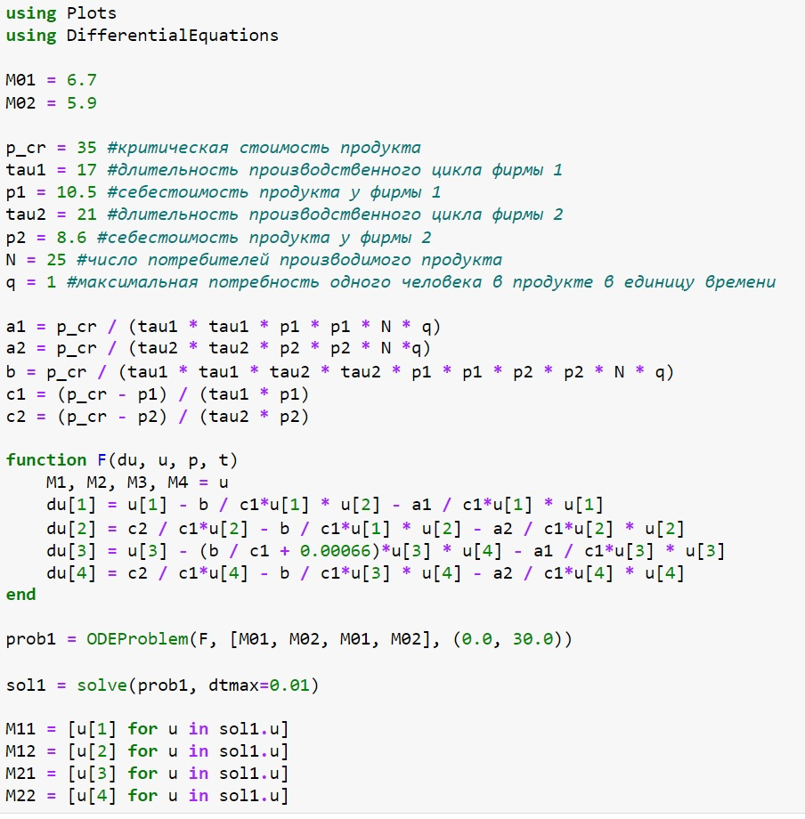{#fig:001 width=70%}

2. Создала график изменения оборотных средств фирмы 1 и фирмы 2 без учета постоянных издержек и с веденной нормировкой для случая 1. (рис. @fig:002)

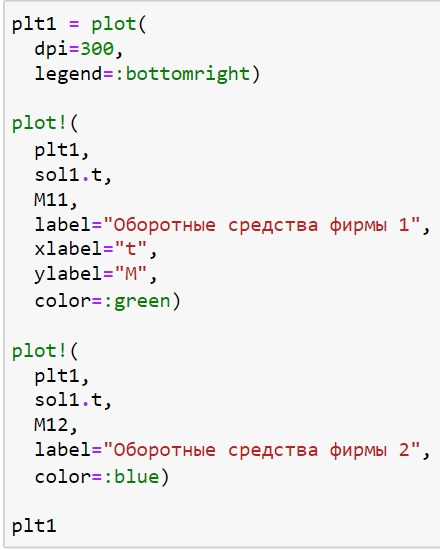{#fig:002 width=70%}

3. Сам график для случая, когда конкурентная борьба ведётся только рыночными методами. (рис. @fig:003)

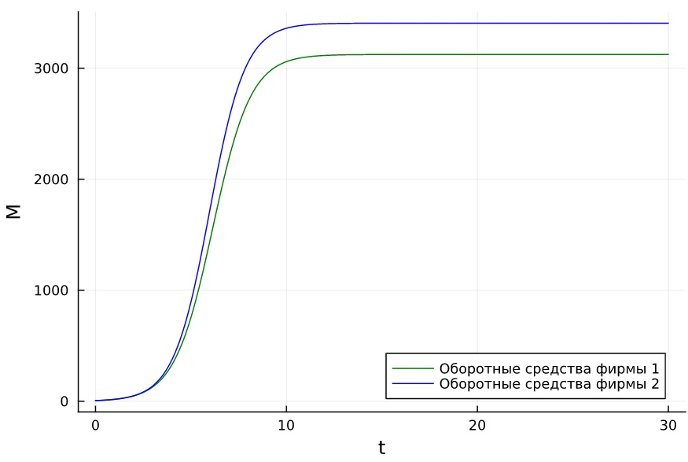{#fig:003 width=70%}

4. Создала график изменения оборотных средств фирмы 1 и фирмы 2 без учета постоянных издержек и с веденной нормировкой для случая 2. (рис. @fig:004)

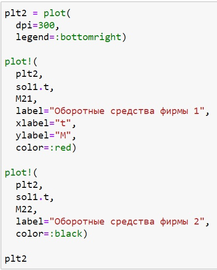{#fig:004 width=70%}

5. Сам график для случая, когда конкурентная борьба ведётся рыночными методами с учётом социально-психологических факторов. (рис. @fig:005)

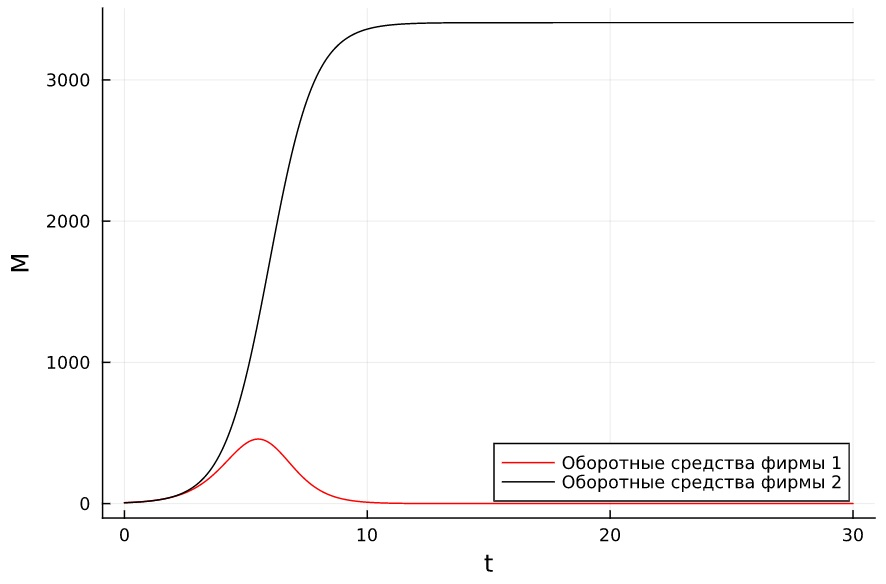{#fig:005 width=70%}

6. Написала код модели 1 для 1 случая на OpenModelica. (рис. @fig:006)

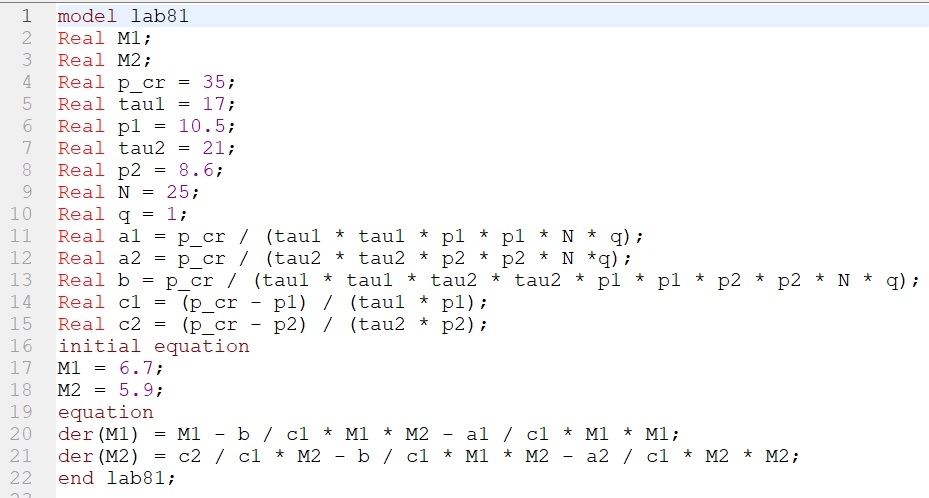{#fig:006 width=70%}

7. Создала график изменения оборотных средств фирмы 1 и фирмы 2 без учета постоянных издержек и с веденной нормировкой для случая 1. (рис. @fig:007)

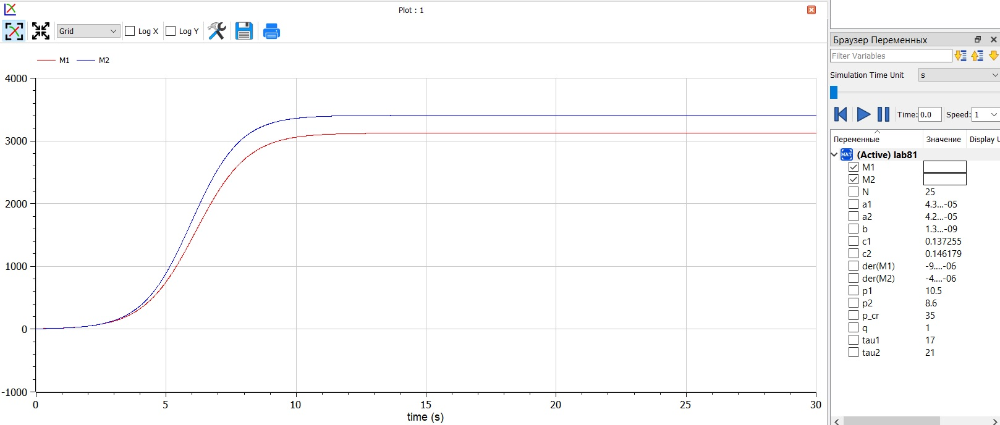{#fig:007 width=70%}

8. Написала код модели 2 для 2 случая на OpenModelica. (рис. @fig:008)

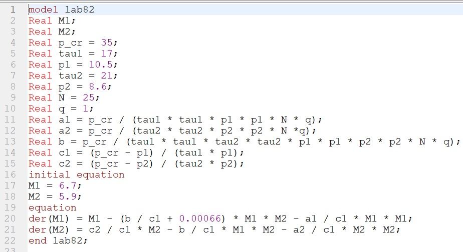{#fig:008 width=70%}

9. Создала график изменения оборотных средств фирмы 1 и фирмы 2 без учета постоянных издержек и с веденной нормировкой для случая 2. (рис. @fig:009)

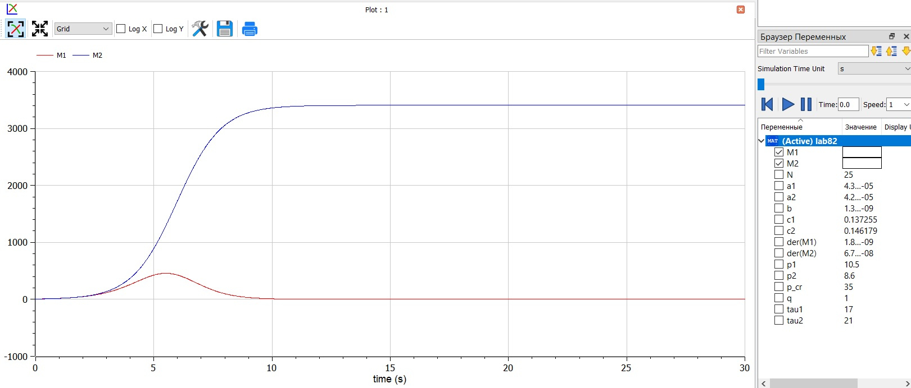{#fig:009 width=70%}

# Сравнение Julia и OpenModelica

Результаты получились одинаковые, однако на Julia можно было строить одновременно 2 случая, в то время как на OpenModelica модели для них необходимо было создавать в отдельных файлах. Также в Julia необходимо было в формате кода задать начальные параметры и создать графики, тогда как на OpenModelica для этого используется графический интерфейс. В связи с этим, код на OpenModelica намного короче, чем на Julia.

# Выводы

В результате работы удалось создать модель конкуренции двух фирм для двух случаев: конкурентная борьба ведётся только рыночными методами и конкурентная борьба ведётся рыночными методами с учётом социально-психологических факторов; удалось построить графики изменения оборотных средств фирмы 1 и фирмы 2 без учета постоянных издержек и с веденной нормировкой для обоих случаев на Julia и OpenModelica. Также в результате работы удалось улучшить навыки решения научных задач на Julia и OpenModelica.

# Список литературы{.unnumbered}

[1] Справочная информация для лабораторной работы 8 в ТУИС на курсе "Математическое моделирование", дата обращения: 01.04.2023, [@mm:lab8](https://github.com/vvsattarova/study_2022-2023_mathmod/blob/master/labs/lab08/report/bib/cite.bib) 

URL: https://esystem.rudn.ru/pluginfile.php/1971672/mod_resource/content/2/%D0%9B%D0%B0%D0%B1%D0%BE%D1%80%D0%B0%D1%82%D0%BE%D1%80%D0%BD%D0%B0%D1%8F%20%D1%80%D0%B0%D0%B1%D0%BE%D1%82%D0%B0%20%E2%84%96%207.pdf.

[2] Варианты заданий для лабораторной работы 8 в ТУИС на курсе "Математическое моделирование", дата обращения: 01.04.2023, [@mm:lab8_task](https://github.com/vvsattarova/study_2022-2023_mathmod/blob/master/labs/lab08/report/bib/cite.bib) 

URL: https://esystem.rudn.ru/pluginfile.php/1971673/mod_resource/content/2/%D0%97%D0%B0%D0%B4%D0%B0%D0%BD%D0%B8%D0%B5%20%D0%BA%20%D0%BB%D0%B0%D0%B1%D0%BE%D1%80%D0%B0%D1%82%D0%BE%D1%80%D0%BD%D0%BE%D0%B9%20%D1%80%D0%B0%D0%B1%D0%BE%D1%82%D0%B5%20%E2%84%96%207.pdf.